<p align="center">
  
</p>

<h1 align="center">Sourcelin Blog</h1>

<p align="center">
  基于 Spring Cloud Alibaba + Vue 3 的全栈微服务博客系统，面向个人写作、毕业设计演示与小团队内容运营，同时沉淀了可直接复用的 AI 协作开发资产。
</p>

<p align="center">
  <a href="https://gitee.com/my_lyq/sourcelin-cloud-blog"></a>
  
  
  
  
  <a href="./LICENSE"></a>
</p>

<p align="center">
  <a href="http://sourcelin.cn/">在线演示</a> |
  <a href="./docs/DOCS_INDEX.md">文档导航</a> |
  <a href="./docs/guides/QUICK_START.md">快速启动</a> |
  <a href="./docker-compose.example.yml">Compose 示例</a> |
  <a href="./docs/guides/CONTRIBUTING.md">参与贡献</a> |
  <a href="https://gitee.com/my_lyq/sourcelin-cloud-blog/issues">提交 Issue</a>
</p>

## 项目定位

Sourcelin Blog（圆圈博客）是一套面向个人写作、生活记录、内容展示和小团队内容运营的现代博客平台，采用前后端分离微服务架构，提供博客前台、管理后台、统一 API 契约、权限体系和完整工程化规范。

它不是单纯的博客 Demo，而是一套可继续二开、可部署上线、可用于毕设展示、也适合做 AI 协作开发实践的全栈项目基线。

本项目当前的开源整理、文档重构、规则沉淀与发布流程治理全程使用 Codex 完成，同时兼容 Codex、Cursor、OpenCode、Claude Code、Qoder、Trae 等主流 AI 编程工具。

## 为什么值得关注

- 微服务全栈架构：基于 Spring Cloud Alibaba，包含网关、认证、系统、博客、文件、监控等完整服务边界。
- 前后台完整交付：同时提供 Vue 3 博客前台和 Vue 3 管理后台，不是只做后端接口或只做单页前端。
- AI Coding 友好：仓库内沉淀了 `AGENTS.md`、`rules/`、`skills/`，本项目开源整理全程使用 Codex 完成，并兼容 Codex、Cursor、OpenCode、Claude Code、Qoder、Trae 等工具协作开发。
- 工程规则明确：统一 API 响应体、分页协议、模块边界和验证要求，适合长期维护和多人协作。
- 场景覆盖完整：适合作为个人博客、内容站、课程项目、毕业设计、二次开发基线。

## 界面预览

### 博客前台

#### 首页


#### 首页内容

| 默认主题 | 暗色主题 |
|---|---|
|  | 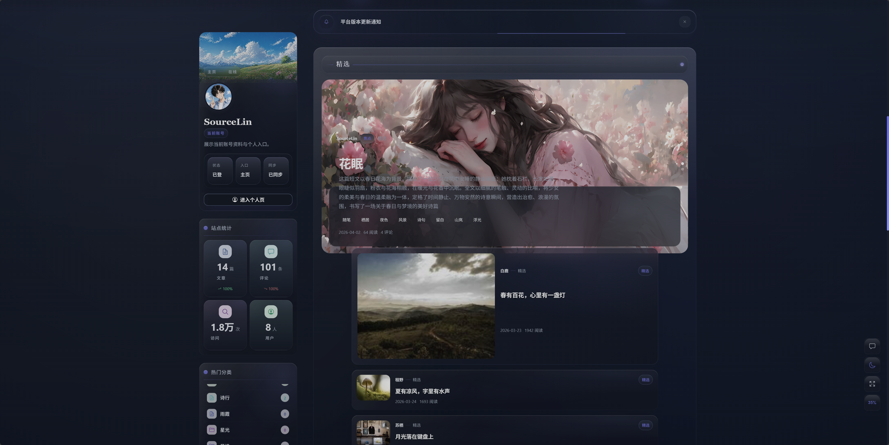 |

#### 文章详情


#### 用户中心

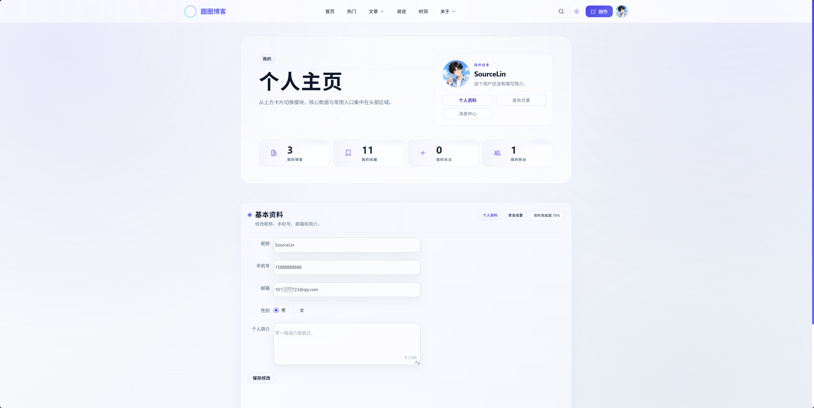

<details>
<summary>查看更多博客前台截图</summary>

#### 分类与标签

| 分类 | 标签 |
|---|---|
| 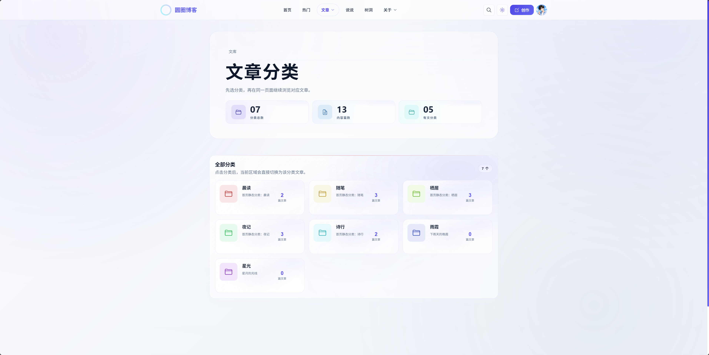 | 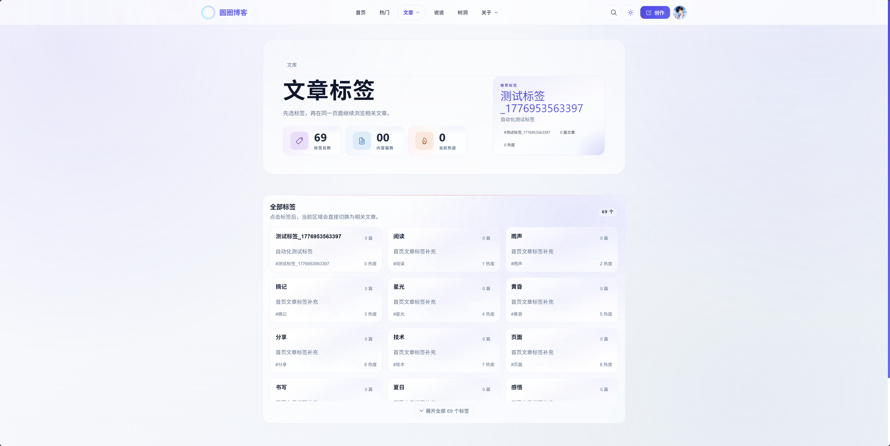 |

#### 归档与热门

| 归档 | 热门 |
|---|---|
| 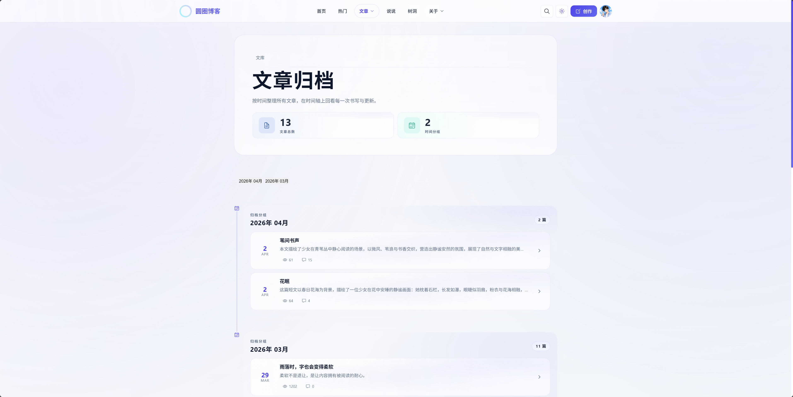 | 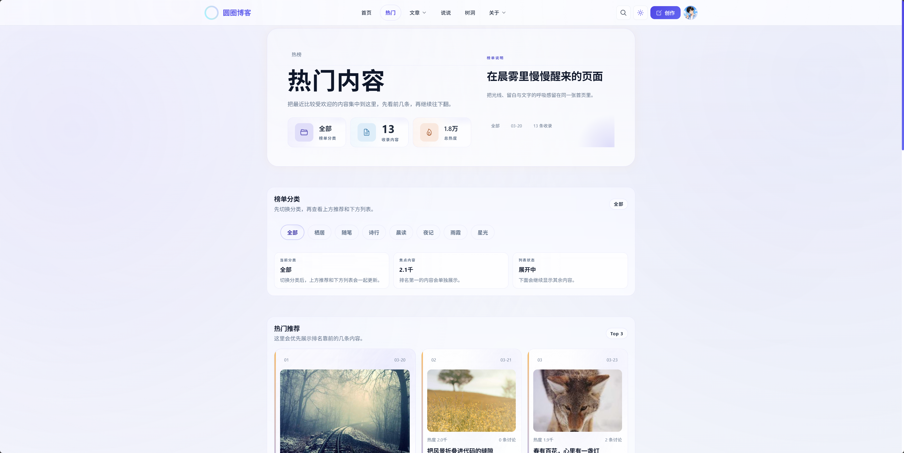 |

#### 说说与树洞

| 说说 | 树洞 |
|---|---|
| 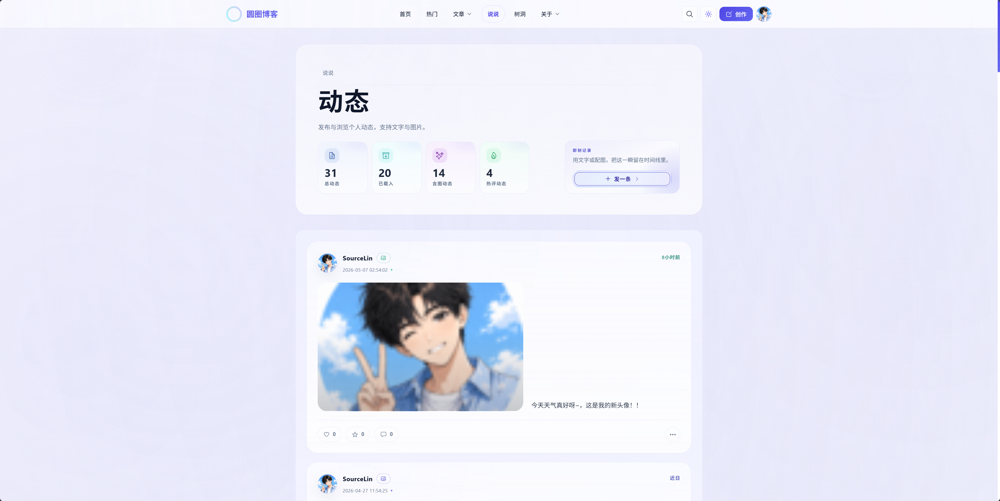 |  |

#### 关于本站与登录

| 关于本站 | 登录 |
|---|---|
| 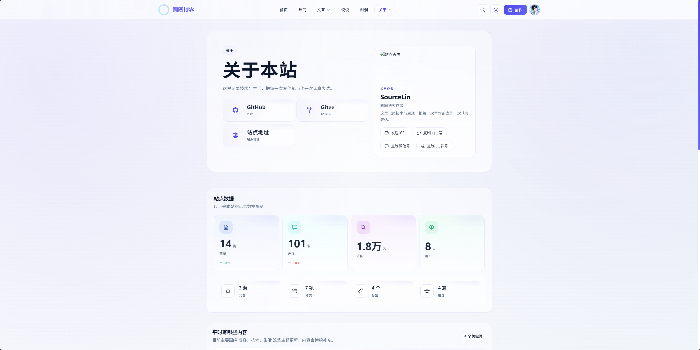 |  |

</details>

### 后台管理

#### 首页与登录

| 管理首页 | 登录页 |
|---|---|
| 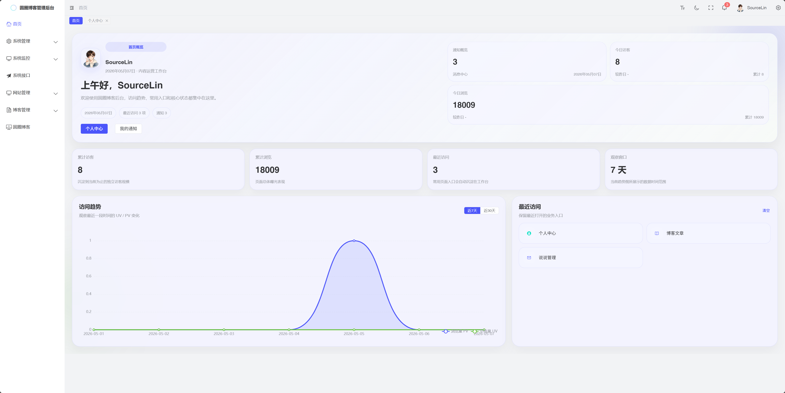 | 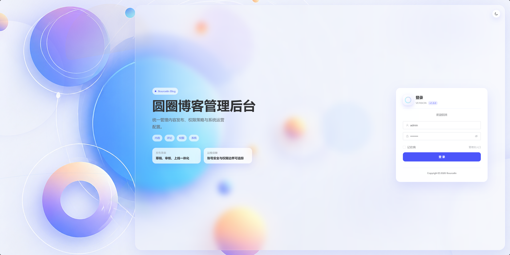 |

#### 核心管理页面

| 系统管理 | 博客管理 |
|---|---|
| 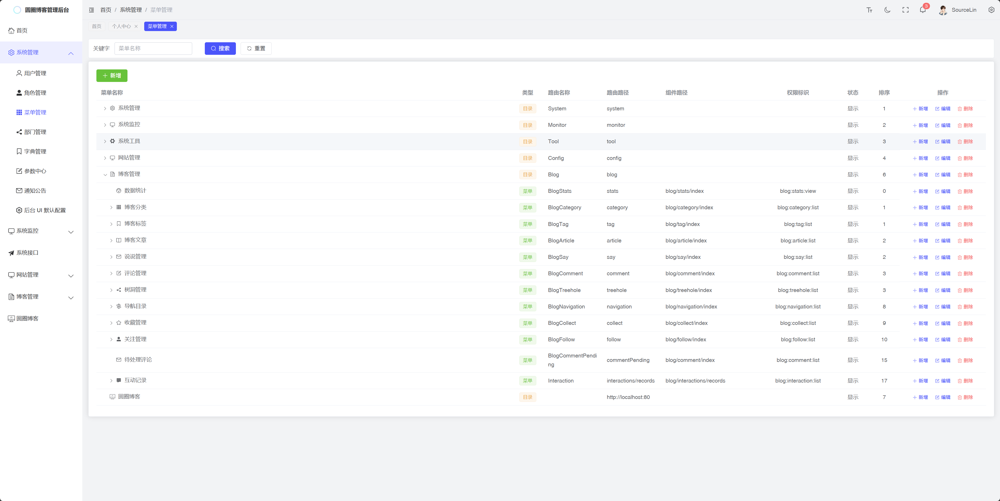 | 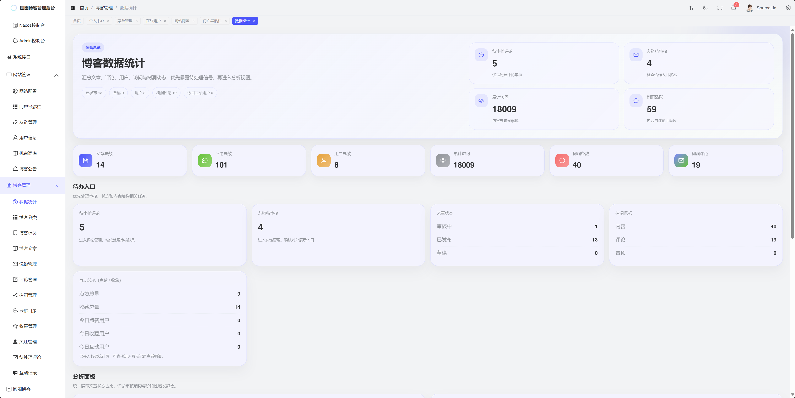 |

| 网站管理 | 系统监控 |
|---|---|
| 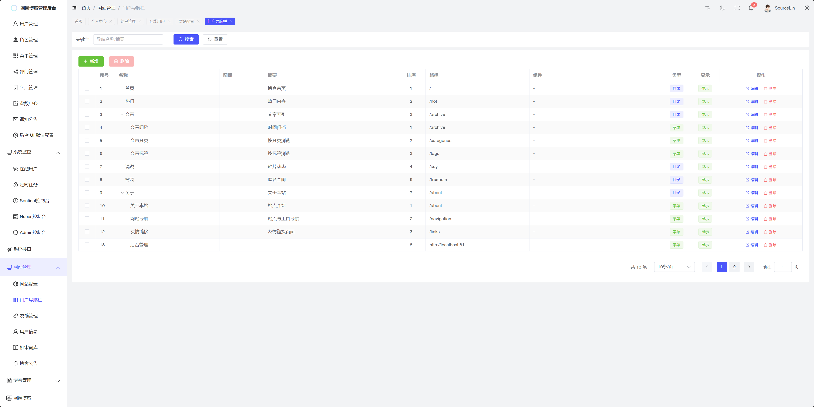 | 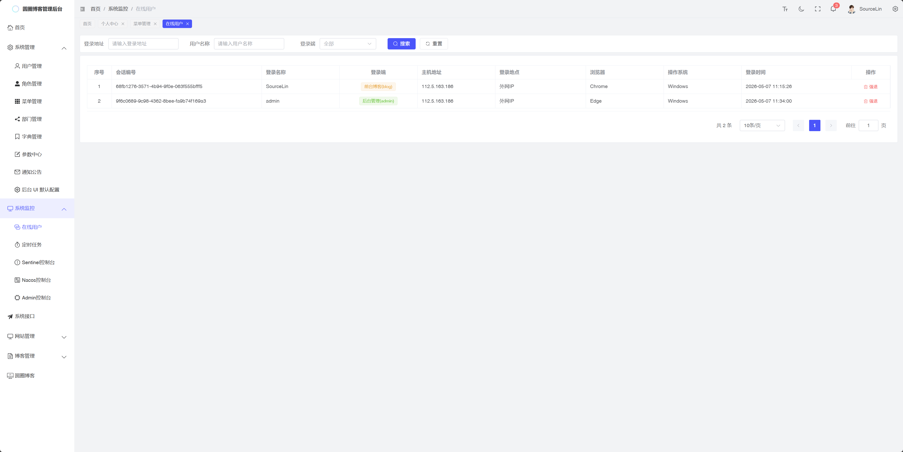 |

#### 内容编辑与个人中心

| 发布文章 | 个人中心 |
|---|---|
| 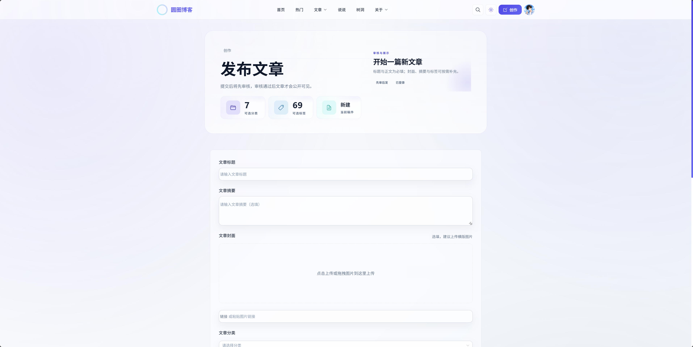 | 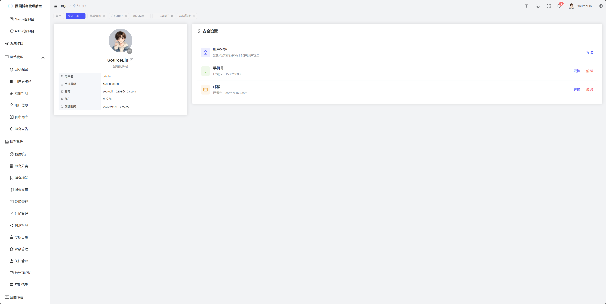 |

## 核心能力

### 博客前台

- 首页推荐、热门文章、分类、标签、归档
- 文章详情、Markdown 渲染、内容展示
- 评论、回复、点赞、收藏、关注
- 说说、树洞、友链、导航、关于页面
- 登录注册、个人中心、资料修改、头像上传

### 管理后台

- 系统管理：用户、角色、菜单、部门、岗位、字典、参数、通知
- 博客管理：文章、分类、标签、评论、友链、用户、导航、配置
- 系统监控：在线用户、定时任务
- 系统工具：代码生成、表单构建
- 文件管理和博客统计

### 后端基础能力

- Spring Cloud Gateway 网关统一入口
- Sa-Token 认证鉴权与权限控制
- Nacos 注册中心与配置中心
- Sentinel 流量控制
- Seata 分布式事务
- Redis 缓存
- MinIO 文件存储
- Spring Boot Admin 监控

## AI Coding 友好

这是本项目和普通博客 CRUD 项目差异最大的一部分。

本项目当前的开源整理、文档体系重构、规则沉淀和发布流程治理，全程使用 Codex 完成；但这套资产本身不绑定单一工具，而是以仓库内的规则、边界和技能说明为核心，可直接迁移到其他支持仓库规则读取的 AI 编程工具中。

仓库内已经沉淀了面向 AI 协作开发的工程资产：

- [`AGENTS.md`](./AGENTS.md)：仓库执行入口、目录边界、发布边界、默认规则
- [`rules/`](./rules/README.md)：API 契约、前后端规范、测试验证规则
- [`skills/`](./skills/README.md)：将规则转成可执行开发流程的技能说明

你可以直接把这套方式复用到自己的项目里，让 AI 工具按统一约束开发、重构、审查和补文档。

### 适合的 AI 工具

- Codex
- Cursor
- OpenCode
- Claude Code
- Qoder
- Trae
- 通义灵码
- 豆包 MarsCode
- GitHub Copilot
- 其他支持仓库规则读取的 AI 编程工具

### 为什么这些工具都能接入

因为本项目的 AI 协作能力不是某个 IDE 插件里的私有配置，而是直接写进仓库的公开资产：

- `AGENTS.md` 负责定义执行入口、目录边界、发布边界和默认约束
- `rules/` 负责定义 API 契约、前后端规范和验证要求
- `skills/` 负责把规则转成可执行的开发流程

只要工具支持读取仓库文件、遵循指令并基于代码上下文执行，这套方式就能复用到同类 AI 编程工具中。

### 相关文章与实践

- [AI 协作开发实践](./docs/promotion/AI_CODING_PRACTICE.md)
- [开源中国发布文章（项目介绍）](https://my.oschina.net/u/4031952/blog/19658286)

### 可直接复用的提示词示例

```text
你现在在 Sourcelin Blog 仓库中工作。
先阅读仓库根目录 AGENTS.md，再按任务读取 rules/README.md 与对应领域规则。
如果是后端任务，读取 rules/backend.md；
如果是博客前台任务，读取 rules/frontend-platform.md；
如果是管理后台任务，读取 rules/frontend-admin.md；
涉及接口或分页时，必须同时遵守 rules/api-contract.md。

输出要求：
1. 默认使用中文沟通
2. 只修改与任务直接相关的文件
3. 保持 ApiResponse / PageResult 契约一致
4. 修改后给出实际执行过的验证命令和结果
```

### 这套规则解决了什么问题

- 避免 AI 在不同模块里随意改风格、改协议、改目录
- 避免前后端继续消费旧字段和旧分页结构
- 降低多人协作或 AI 接力开发时的上下文丢失
- 让重构、规则治理、开源整理都能沉淀成长期资产

## 技术栈

### 后端

| 技术 | 版本 / 说明 |
|---|---|
| Java | 1.8+ |
| Spring Boot | 2.7.18 |
| Spring Cloud | 2021.0.9 |
| Spring Cloud Alibaba | 2021.0.6.1 |
| Nacos | 注册中心 / 配置中心 |
| Sentinel | 流量控制 |
| Seata | 分布式事务 |
| MySQL | 8.0+ |
| Redis | 缓存 |
| Druid | 数据源 |
| PageHelper | 分页 |
| MinIO | 文件存储 |
| Hutool | 工具库 |
| FastJSON2 | JSON 处理 |
| Sa-Token | 认证鉴权 |

### 前端

| 端 | 技术栈 |
|---|---|
| 博客前台 | Vue 3 + TypeScript + Naive UI + Vite |
| 管理后台 | Vue 3 + TypeScript + Element Plus |

## 设计系统与主题

### 博客前台 — 液态玻璃设计系统

博客前台采用自研的 **Liquid Glass（液态玻璃）** UI 设计语言，以物理光学隐喻构建整站视觉层次：

- **双主题覆盖**：亮色主题采用冷调编辑感玻璃面板，暗色主题以星空纵深为底、靛蓝低饱和辉光为边缘，通过 `html[data-theme]` 统一切换。
- **核心色彩体系**：
  - 主色靛蓝 `#4F46E5`，次要色 `#6366F1`，强调色 `#A5B4FC`
  - 琥珀金伴色 `#F59E0B`（光学伴色，遵循 80/15/5 配比原则）
  - 极光绿配角 `#34D399`（仅暗色模式辅助）
- **四种光学变体**：
  | 变体 | 隐喻 | 适用场景 |
  |---|---|---|
  | 冰晶玻璃 (Ice Crystal) | 厚重冰块，锐利顶部高光 | 阅读容器、正文卡片 |
  | 水滴玻璃 (Water Drop) | 悬浮水珠，折射环境光 | 标准内容卡、悬浮控件 |
  | 雾面玻璃 (Frosted Panel) | 磨砂镜面，散射侧光 | 侧边栏、页脚、弱背景层 |
  | 宝石玻璃 (Gem) | 高折射品牌时刻 | 极少量强调场景 |
- **Token 体系**：`base.scss`（基础色彩/玻璃参数）→ `component.scss`（面板/卡片/阴影语义）→ `foundation/`（玻璃表面类、`backdrop-filter`、SCSS mixins），全部基于 CSS 变量与 `color-mix()` 实现亮暗双态自适配。
- **关键参数**：`backdrop-filter: blur(26px) saturate(138%~148%)`，配合动态折射纹理、顶部高光伪元素与噪声颗粒，实现物理级玻璃质感。

### 管理后台 — Element Plus 主题体系

管理后台基于 Element Plus CSS 变量构建，支持灵活的主题与布局组合：

- **三种主题模式**：浅色 (Light) / 深色 (Dark) / 跟随系统 (Auto)
- **两种侧边栏风格**：经典蓝 (Classic Blue) / 极简白 (Minimal White)
- **三种布局方式**：左侧菜单 / 顶部菜单 / 混合菜单
- **主题色自定义**：通过系统配置页面中的 Color Picker 实时调整主品牌色，全局同步生效
- **双轨变量**：CSS 变量负责运行时主题切换，SCSS 变量负责编译时布局尺寸，兼顾动态性与性能

## 适用场景

- 个人博客和内容沉淀
- 生活记录和作品展示
- 小团队内容运营后台
- 微服务博客系统二次开发
- Java + Vue 全栈练手项目
- 毕业设计 / 课程设计展示
- AI 辅助重构和规则治理实践

## 1 分钟快速了解

如果你只是想先判断项目是否值得用，建议按下面顺序：

1. 打开 [在线演示](http://sourcelin.cn/)
2. 查看上面的界面截图，确认前后台形态
3. 阅读 [`AGENTS.md`](./AGENTS.md)、[`rules/`](./rules/README.md)、[`skills/`](./skills/README.md)，判断是否适合你的 AI 协作方式，以及是否需要接入 Codex、Cursor、OpenCode、Claude Code、Qoder、Trae 等工具
4. 再决定本地启动还是 Docker 部署

## 快速开始

### 环境要求

| 组件 | 最低版本 | 推荐版本 |
|---|---|---|
| JDK | 1.8+ | 1.8 / 11 |
| Maven | 3.6+ | 3.8.x |
| MySQL | 5.7+ | 8.0 |
| Redis | 5.0+ | 6.0+ |
| Node.js | 14+ | 18 LTS |
| Nacos | 2.0+ | 2.0.x |
| Docker | 20+ | 24.x |

### 本地启动

#### 1. 克隆仓库

```bash
git clone https://gitee.com/my_lyq/sourcelin-cloud-blog.git
cd sourcelin-cloud-blog
```

#### 2. 初始化数据库

```bash
mysql -u root -p < docs/sql/sourcelin-cloud.sql
mysql -u root -p < docs/sql/sourcelin-config.sql
mysql -u root -p < docs/sql/sourcelin-seata.sql
```

#### 3. 启动基础依赖

- MySQL
- Redis
- Nacos

#### 4. 按需调整配置

修改各模块 `bootstrap.yml` 中的 MySQL、Redis、Nacos 连接信息。

#### 5. 启动后端服务

```bash
mvn clean package -DskipTests

java -jar sourcelin-gateway/target/sourcelin-gateway.jar
java -jar sourcelin-auth/target/sourcelin-auth.jar
java -jar sourcelin-modules/sourcelin-system/target/sourcelin-system.jar
java -jar sourcelin-modules/sourcelin-blog/target/sourcelin-blog.jar
```

如需完整能力，可再启动：

```bash
java -jar sourcelin-modules/sourcelin-file/target/sourcelin-file.jar
java -jar sourcelin-visual/sourcelin-visual-monitor/target/sourcelin-visual-monitor.jar
```

#### 6. 启动前端

```bash
cd sourcelin-ui/sourcelin-ui-admin
pnpm install
pnpm run dev
```

```bash
cd sourcelin-ui/sourcelin-ui-platform
npm install
npm run dev
```

### Docker 部署

当前仓库已提供可公开复用的 Compose 示例和通用部署文档：

- [`docker-compose.example.yml`](./docker-compose.example.yml)
- [`.env.example`](./.env.example)
- [`docs/guides/QUICK_START.md`](./docs/guides/QUICK_START.md)
- [`docs/deployment/NGINX_CONFIG.md`](./docs/deployment/NGINX_CONFIG.md)
- [`docs/deployment/UPGRADE.md`](./docs/deployment/UPGRADE.md)

适合人群：

- 想快速落地到云服务器
- 需要单域名前后台部署
- 需要参考公开的 Compose、Nginx、网关入口与升级方式

最小使用方式：

```bash
cp .env.example .env
# 按实际环境修改 .env
docker compose -f docker-compose.example.yml up -d
```

## 新手避坑指南

- 先确认 MySQL、Redis、Nacos 已可用，再启动微服务；否则大部分启动失败都只是基础依赖未就绪。
- `docs/sql/sourcelin-config.sql` 不是业务表，它用于初始化 Nacos 配置，缺它时服务可能能启动但配置不完整。
- 管理后台部署到 `/admin/` 时，前端构建需要带 `--base=/admin/`。
- 如果只是本地调试博客能力，优先启动 `gateway`、`auth`、`system`、`blog` 四个核心服务即可。
- Docker 部署前先阅读 [`docs/guides/QUICK_START.md`](./docs/guides/QUICK_START.md) 和 [`docs/deployment/NGINX_CONFIG.md`](./docs/deployment/NGINX_CONFIG.md)，确认目录、端口和网关入口是否符合你的环境。

## 项目结构

```text
sourcelin-cloud-blog/
├── sourcelin-api/                         # Feign 接口与跨服务 DTO
├── sourcelin-common/                      # 公共能力
├── sourcelin-gateway/                     # 网关
├── sourcelin-auth/                        # 认证中心
├── sourcelin-modules/
│   ├── sourcelin-system/                  # 系统管理
│   ├── sourcelin-blog/                    # 博客业务
│   ├── sourcelin-file/                    # 文件服务
│   └── sourcelin-job/                     # 定时任务
├── sourcelin-visual/                      # 监控等可视化服务
├── sourcelin-ui/
│   ├── sourcelin-ui-platform/             # 博客前台
│   ├── sourcelin-ui-admin/                # 管理后台
│   └── sourcelin-ui-admin-vue2/           # 旧版迁移对照
├── docs/                                  # 项目文档
├── rules/                                 # 仓库规则
├── skills/                                # AI 协作技能
└── AGENTS.md                              # 仓库执行入口
```

## API 契约

本项目对外 HTTP JSON 接口统一使用：

- `ApiResponse<T>` 顶层结构
- 成功码固定为 `0`
- 顶层字段固定为 `code / message / data / requestId / timestamp`
- 分页固定为 `PageResult<T>`
- 分页字段固定为 `items / total / page / pageSize / totalPages`

详细说明见 [`rules/api-contract.md`](./rules/api-contract.md) 和 [`docs/architecture/api-contract.md`](./docs/architecture/api-contract.md)。

## 文档导航

- [文档索引](./docs/DOCS_INDEX.md)
- [快速启动](./docs/guides/QUICK_START.md)
- [Compose 示例](./docker-compose.example.yml)
- [案例墙](./docs/guides/SHOWCASE.md)
- [AI 协作开发实践](./docs/promotion/AI_CODING_PRACTICE.md)
- [贡献指南](./docs/guides/CONTRIBUTING.md)
- [更新日志](./docs/guides/CHANGELOG.md)
- [支持说明](./docs/guides/SUPPORT.md)
- [Nginx 配置说明](./docs/deployment/NGINX_CONFIG.md)
- [升级说明](./docs/deployment/UPGRADE.md)
- [SQL 脚本说明](./docs/sql/README.md)

## Roadmap

- App / 小程序端能力完善
- AI 内容助手
- AI 审核升级
- 消息中心增强
- SSE 实时推送
- Python 转载系统
- SEO / 流量增长
- 运营看板

## 参与贡献

欢迎以下类型的贡献：

- 提交 Bug 和问题反馈
- 提出新功能建议
- 补充文档和截图
- 修复前后端问题
- 完善部署说明和示例配置
- 贡献二次开发案例

开始之前建议先阅读 [`docs/guides/CONTRIBUTING.md`](./docs/guides/CONTRIBUTING.md)。

## 用户案例征集

如果你已经成功部署了 Sourcelin Blog，欢迎通过 Issue 或 PR 提交你的站点链接、使用场景和部署方式。

后续可以在 README 中收录：

- 个人博客案例
- 毕设 / 课程项目案例
- 小团队内容站案例

案例入口见 [`docs/guides/SHOWCASE.md`](./docs/guides/SHOWCASE.md)。

## 常见问题

### 可以商用吗？

可以。本项目采用 [MIT License](./LICENSE)，请保留许可证和版权声明。

### 适合拿来做毕业设计吗？

适合。它同时包含前台、后台、微服务、权限、部署和工程规则，展示面比较完整。

### 适合二次开发吗？

适合。仓库结构、API 契约和 AI 协作规则已经做了较明确的边界约束，适合作为业务二开的基线。

### 支持 Docker 吗？

支持参考现有部署基线文档落地到服务器，部署说明见上方 Docker 相关文档入口。

## 支持与合作

- 免费支持：环境配置、部署答疑、常见问题排查
- 企业服务：私有化部署、定制开发、培训指导、安全加固

详细说明见 [`docs/guides/SUPPORT.md`](./docs/guides/SUPPORT.md)。

## Star 支持

如果这个项目对你有帮助，欢迎点一个 Star。

你的支持会直接推动后续的功能迭代、文档完善、部署优化和 AI 协作规则继续沉淀。
