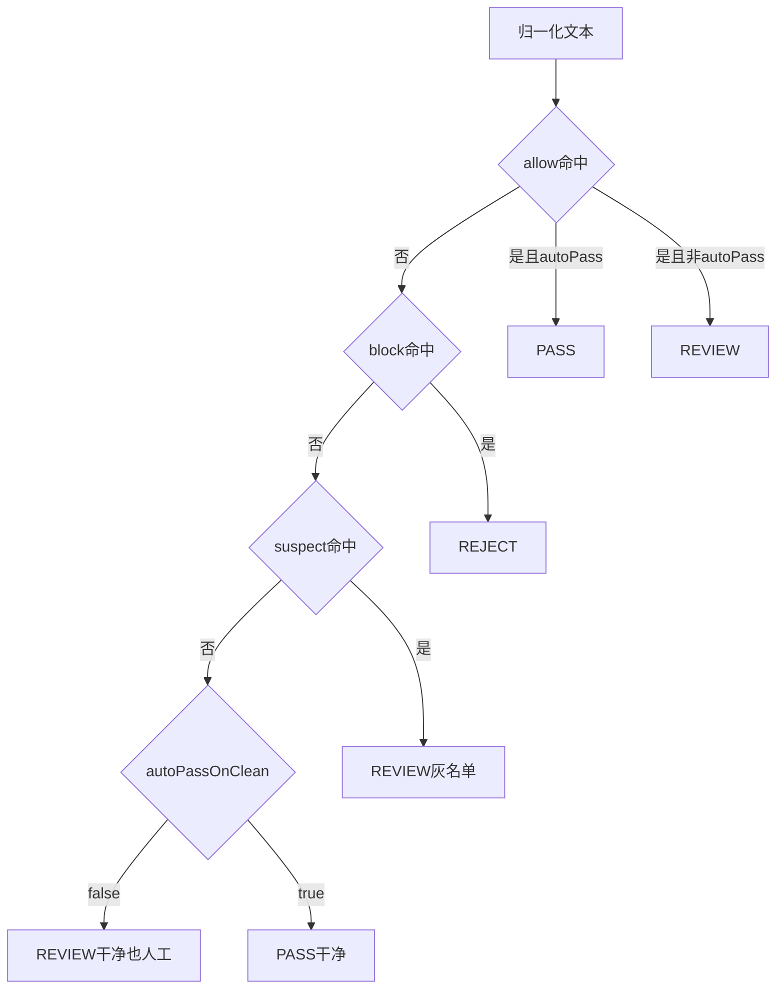

# 博客服务（sourcelin-blog）评论机审 Nacos 配置

对应代码：`ModerationProperties`（`prefix = moderation`），支持 `@RefreshScope` 热更新。

**生效范围**：前台 `POST /front/comments` 在 `source` 为 **`article`、`say`、`treehole`** 时均走 [`ModerationPipeline`](../../sourcelin-modules/sourcelin-blog/src/main/java/com/sourcelin/blog/service/ModerationPipeline.java)（见 `FrontCommentController#needsContentModeration`）。树洞评论与文章、说说共用本配置中的 `allow` / `block` / `suspect` 与 `auto-pass-on-clean`；**仅机审通过（`status=1`）** 时才会对说说/树洞目标执行 `comment_count +1`。

## 配置项

| YAML 路径 | 类型 | 默认建议 | 说明 |
|-----------|------|----------|------|
| `moderation.article.auto-pass-on-clean` | boolean | `true` | 干净内容自动 `status=1`；`false` 时非 BLOCK 一律 `REVIEW`（`status=0`）应急全人工。 |
| `moderation.keyword.version` | int | `1` | 词库逻辑版本；**改词表须 +1** 以触发内存 WordTree 重建。 |
| `moderation.ai-enabled` | boolean | `false` | 一期占位。 |
| `moderation.keyword.allow` | string 列表 | `[]` | 白名单，命中后按 `auto-pass-on-clean` 决定 PASS 或 REVIEW。 |
| `moderation.keyword.block` | string 列表 | `[]` | 黑名单 → `REJECT` / `status=2`。 |
| `moderation.keyword.suspect` | string 列表 | `[]` | 灰名单 → `AI_REVIEW` / `status=0`。 |

## 匹配顺序与 allow 优先级（必读）

实现见 [`ModerationPipeline.java`](../../sourcelin-modules/sourcelin-blog/src/main/java/com/sourcelin/blog/service/ModerationPipeline.java)，子串匹配顺序为：

1. **`allow`**：任一命中 → `auto-pass-on-clean=true` 时 **直接 PASS**，**不再检查** `block` / `suspect`。
2. **`block`**：命中 → **REJECT**（`status=2`）。
3. **`suspect`**：命中 → **待审**（`AI_REVIEW` / `status=0`）。

**警告**：`allow` 只适合 **整词或短语**（如 `官方公告`），不要配置「官」「微」等过短词，否则垃圾评论只要带上该子串即可绕过黑名单。



## 与常见开源分层词表的对齐

| 列表 | 开源/社区常见用途 | 本项目效果 |
|------|-------------------|------------|
| `allow` | 误杀修正、品牌/活动固定文案、技术术语整词 | 最高优先级放行（慎用短词） |
| `block` | 高置信非法/暴恐色情毒品诈骗等强规则（需按辖区与合规自建并审计） | 直接拒绝 |
| `suspect` | 导流、刷单、SEO 灰产、联系方式变体、灌水模板 | 进人工/待审 |

公开中英文敏感词仓库多为演示或需合规审查；生产环境建议 **小清单上线**，结合后台待审/拒绝记录再扩容，每次改词递增 `moderation.keyword.version`。

## 示例（粘贴到 Nacos 中博客 dataId 的 YAML）

下面为**最简示意**；`block` **完整示例词表**见下文「### block（强拒绝）」与「起步配置整段 YAML」。

```yaml
moderation:
  article:
    auto-pass-on-clean: true
  keyword:
    version: 1
    allow:
      - 官方公告
    block:
      - 违禁词示例
    suspect:
      - 广告
  ai-enabled: false
```

## 推荐起步词表（博客）

面向中文技术博客/评论：**`block` 下列为演示级较完整示例**（含低俗辱骂与灰黑产高频词，**生产务必经运营/法务审核并裁剪**）；**`suspect` 侧重导流与灰产话术**；**`allow` 用语境明确的短语**（按站点真实栏目名替换）。

### allow（短语级，防误杀）

- 站点/栏目固定说法示例：`官方公告`、`版本更新说明`、`开源协议`、`MIT协议`、`Apache协议`。
- 若 `suspect` 中含「微信」等子串，易误杀技术正文时，可用 **更长短语** 放行，例如：`微信小程序`（勿单独放行「微信」除非明确接受风险）。
- 普通礼貌用语一般不必写入 `allow`。

### block（强拒绝）

以下为 **可直接粘贴的较完整示例**（按常见开源敏感词/反垃圾分层习惯归类）。子串匹配：过短词易误杀（如化学、安防文章谈「炸药」），请按站点内容用 **`allow` 短语** 或删词微调。

```yaml
block:
  # 辱骂、人身攻击（中文社区常见变体，可按文明程度删减）
  - 傻逼
  - 煞笔
  - 沙比
  - 脑残
  - 弱智
  - 废物
  - 滚粗
  - 去死
  - 草泥马
  - 操你妈
  - 艹你
  - 尼玛
  - 狗日的
  - 贱人
  - 婊子
  - 杂种
  # 诈骗、传销、洗钱话术
  - 杀猪盘
  - 跑分
  - 洗钱
  - 日赚千元
  - 稳赚不赔
  - 内部消息股
  - 配资开户
  - 代还信用卡
  - 网贷套现
  # 赌博
  - 网赌
  - 赌球
  - 六合彩
  - 在线博彩
  - 投注平台
  # 色情招嫖、裸聊引流
  - 招嫖
  - 约炮
  - 一夜情
  - 上门服务
  - 裸聊
  - 看片加
  - 成人视频
  # 违法代办、假证、违禁品（技术文讨论需慎用，可删或配合 allow）
  - 代考包过
  - 办假证
  - 高仿证件
  - 枪支
  - 炸药
  - 冰毒
  - 海洛因
  - 罂粟
```

建议：上线后根据 **误杀/漏放** 日志持续迭代；批量合并外部词库后务必 **人工抽检**。

### suspect（灰名单：反垃圾常见）

导流、兼职、SEO、站外交易等高频模式，可按评论实际命中情况增删：

```yaml
suspect:
  - 加微信
  - 加VX
  - 加qq
  - 加QQ
  - 私信我
  - 联系我领取
  - 免费领取
  - 刷单
  - 网赚
  - 代开发票
  - SEO优化
  - 包年排名
  - 代写论文
  - 论文代写
  - 博彩
  - 菠菜
```

若正常讨论被误杀（如「私信我」），可改为更长短语（如 `加我微信领资料`）或增加 **精确的 `allow` 短语** 对冲。

## 起步配置整段 YAML（合并后记得 version +1）

将下列 `moderation.keyword` 合并进博客 Nacos YAML；**首次使用或每次改词**均递增 `version`：

```yaml
moderation:
  article:
    auto-pass-on-clean: true
  keyword:
    version: 1
    allow:
      - 官方公告
      - 版本更新说明
      - 开源协议
      - MIT协议
      - Apache协议
    block:
      - 傻逼
      - 煞笔
      - 沙比
      - 脑残
      - 弱智
      - 废物
      - 滚粗
      - 去死
      - 草泥马
      - 操你妈
      - 艹你
      - 尼玛
      - 狗日的
      - 贱人
      - 婊子
      - 杂种
      - 杀猪盘
      - 跑分
      - 洗钱
      - 日赚千元
      - 稳赚不赔
      - 内部消息股
      - 配资开户
      - 代还信用卡
      - 网贷套现
      - 网赌
      - 赌球
      - 六合彩
      - 在线博彩
      - 投注平台
      - 招嫖
      - 约炮
      - 一夜情
      - 上门服务
      - 裸聊
      - 看片加
      - 成人视频
      - 代考包过
      - 办假证
      - 高仿证件
      - 枪支
      - 炸药
      - 冰毒
      - 海洛因
      - 罂粟
    suspect:
      - 加微信
      - 加VX
      - 加qq
      - 加QQ
      - 私信我
      - 联系我领取
      - 免费领取
      - 刷单
      - 网赚
      - 代开发票
      - SEO优化
      - 包年排名
      - 代写论文
      - 论文代写
      - 博彩
      - 菠菜
  ai-enabled: false
```

## 运维注意

1. 修改 `allow` / `block` / `suspect` 后务必递增 `moderation.keyword.version`。  
2. 应急关闭自动过审：将 `moderation.article.auto-pass-on-clean` 设为 `false` 并发布。  
3. 数据库需先执行增量脚本：`sql/20260405_blog_comment_moderation.sql`。  
4. 管理端权限：执行 `sql/20260405_blog_moderation_menu.sql` 后，为角色分配菜单/权限；接口前缀为 `/admin/moderation/keyword/*`（经网关转发为 `/blog/admin/moderation/...`，以现网为准）。  
5. **管理后台页面**（`sourcelin-ui-admin`）：菜单「机审词库」→ 组件 `blog/moderation/index`，可查看当前词库、从 Nacos 配置重建内存、或将表单词表**仅写入当前实例内存**（持久化仍以 Nacos 为准）。

## 相关实现说明

评论审核的长期配置基线以本文和当前代码实现为准；一次性实施计划不再作为长期文档维护。
