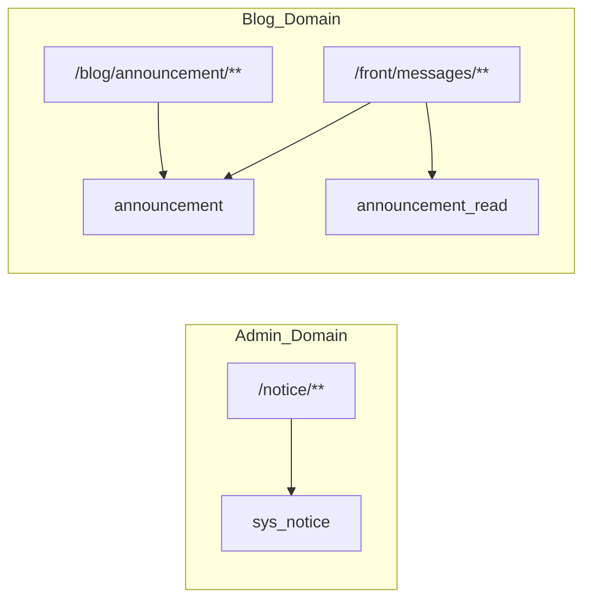

# 博客前台通知公告（Announcement）完整闭环方案（无历史兼容）

## 1. 背景与目标

- 后台 `system/notice` 仅服务管理系统，不再面向博客前台用户。
- 博客前台通知采用独立领域模型：`announcement` + `announcement_read`。
- 不做历史数据兼容，不复用 `sys_notice` / `sys_notice_read`，不保留旧读链路。
- 首期采用**模式 A：广播公告基础版**，优先稳定与低成本交付。

## 1.1 模式 A 定义（本方案范围）

适用场景（平台主动发出）：
- 公告通知
- 活动通知
- 系统提醒
- 审核结果
- 举报处理结果
- 封禁/警告通知
- 安全提醒

核心特征：
- 一条公告面向大量用户（或按作用域定向）。
- 不为每个用户物理生成一条消息记录，避免写放大。
- 通过 `announcement_read` 记录“谁读过哪条公告”，在查询时动态计算未读。

非目标（本期不做）：
- 实时推送（WebSocket/SSE）
- 多渠道触达（邮件/短信）
- 历史消息模型迁移与兼容适配

## 2. 领域边界



约束：
- 禁止 `FrontNoticeController -> RemoteNoticeService` 继续读取 system 公告。
- 禁止跨域直接共表。

## 3. 数据模型设计

### 3.1 公告主表 `announcement`

| 字段 | 类型 | 约束/说明 |
|------|------|-----------|
| id | bigint | PK，自增 |
| title | varchar(200) | NOT NULL，公告标题 |
| content | mediumtext | NOT NULL，富文本正文 |
| scope_type | varchar(16) | NOT NULL，`all/role/segment/assign` |
| scope_payload | json | NULL，作用域参数（roleId 列表、segment 规则、assign userId 列表） |
| publish_status | char(1) | NOT NULL，`0`草稿 `1`已发布 `2`已下线 |
| publish_time | datetime | NULL，发布时间 |
| expire_time | datetime | NULL，过期时间（为空表示不过期） |
| created_by | varchar(64) | 默认空串 |
| created_at | datetime | NOT NULL |
| updated_by | varchar(64) | 默认空串 |
| updated_at | datetime | NULL |
| deleted | int | 默认 0，软删除标记 |

建议索引：
- `idx_announcement_publish (publish_status, publish_time, expire_time, deleted)`
- `idx_announcement_scope (scope_type, deleted)`
- `idx_announcement_created_at (created_at)`

### 3.2 公告已读表 `announcement_read`

| 字段 | 类型 | 约束/说明 |
|------|------|-----------|
| id | bigint | PK，自增 |
| announcement_id | bigint | NOT NULL，公告 ID |
| user_id | bigint | NOT NULL，用户 ID |
| read_time | datetime | NOT NULL，读取时间 |

建议索引与约束：
- 唯一键 `uk_user_announcement (user_id, announcement_id)`（幂等防重）
- 普通索引 `idx_announcement_id (announcement_id)`
- 普通索引 `idx_user_read_time (user_id, read_time)`

### 3.3 可见性判定规则

前台查询统一满足：
1. `deleted = 0`
2. `publish_status = '1'`
3. `publish_time <= now()`
4. `expire_time is null or expire_time > now()`
5. 作用域命中：
   - `all`：所有人可见
   - `role`：登录后角色命中
   - `segment`：登录后标签/分群命中
   - `assign`：登录后用户 ID 命中 `scope_payload`

未读计算（登录用户）：
- `unread = 可见公告集合 - announcement_read(user_id=当前用户)`.
- SQL 层可用 `NOT EXISTS` / `LEFT JOIN ... IS NULL` 实现。

## 3.4 基础版实施范围（强约束）

- 第一阶段只启用 `scope_type in (all, assign)`。
- `role/segment` 保留字段与接口能力，但不在首发实现规则引擎。
- 运营端先满足“全体广播 + 指定用户通知”两类场景。

## 4. API 设计（前台 + 管理端）

### 4.1 前台读取与已读（`/front/messages`）

1. `GET /front/messages`
   - Query：`channel=system&page=1&pageSize=10`
   - 返回：`PageResult<AnnouncementListItem>`
2. `GET /front/messages/{id}`
   - 返回：`AnnouncementDetail`
3. `POST /front/messages/{id}/read`
   - 登录态，幂等写入 `announcement_read`
4. `POST /front/messages/read-all`
   - 登录态，按 `channel` 或全量标记已读
5. `GET /front/messages/unread-count`
   - 登录态，返回未读总数与各频道未读

轮询策略（基础版）：
- 页面加载时立即调用一次 `unread-count`。
- 常驻页面每 `30~60s` 轮询一次（默认 60s）。
- 页面进入后台（`document.hidden = true`）暂停轮询，恢复前台后立即补拉一次。

### 4.2 管理端发布（`/blog/announcement`）

1. `GET /blog/announcement/list`
2. `GET /blog/announcement/{id}`
3. `POST /blog/announcement`（创建草稿）
4. `PUT /blog/announcement`（修改）
5. `POST /blog/announcement/{id}/publish`
6. `POST /blog/announcement/{id}/offline`
7. `DELETE /blog/announcement/{ids}`

权限建议：
- `blog:announcement:list/query/add/edit/publish/offline/remove`

## 5. 与现有消息中心整合

现有页面保留：
- `sourcelin-ui/sourcelin-ui-platform/src/modules/notice/pages/MessageCenterPage.vue`
- `sourcelin-ui/sourcelin-ui-platform/src/modules/notice/config/channels.ts`

改造点：
1. `useMessageCenter.ts` 从 `getNotices()` 切换到 `/front/messages`
2. `message-inbox-badge.store.ts` 从“条数占位”切换成 `unread-count` 真值
3. `NoticeList.vue` 增加已读态 UI 和单条已读事件
4. 保留 `interaction/star/follow` 频道壳，后续再接真实事件源
5. 新增 unread 轮询调度（30~60s）并处理页面可见性暂停/恢复

## 6. 后端实施清单（文件级）

建议落位（blog 模块）：
- `domain/Announcement.java`
- `domain/AnnouncementRead.java`
- `mapper/AnnouncementMapper.java`
- `mapper/AnnouncementReadMapper.java`
- `resources/mapper/blog/AnnouncementMapper.xml`
- `resources/mapper/blog/AnnouncementReadMapper.xml`
- `service/IAnnouncementService.java`
- `service/impl/AnnouncementServiceImpl.java`
- `controller/front/FrontMessageController.java`
- `controller/admin/BlogAnnouncementController.java`

下线与移除：
- `FrontNoticeController` 不再依赖 `RemoteNoticeService`
- `/front/notices` 从前台调用链彻底移除（允许接口删除）

## 7. 数据库 DDL 样例

```sql
CREATE TABLE `announcement` (
  `id` bigint NOT NULL AUTO_INCREMENT COMMENT '主键',
  `title` varchar(200) NOT NULL COMMENT '标题',
  `content` mediumtext NOT NULL COMMENT '内容',
  `scope_type` varchar(16) NOT NULL COMMENT '作用域 all/role/segment/assign',
  `scope_payload` json DEFAULT NULL COMMENT '作用域参数',
  `publish_status` char(1) NOT NULL DEFAULT '0' COMMENT '0草稿 1发布 2下线',
  `publish_time` datetime DEFAULT NULL COMMENT '发布时间',
  `expire_time` datetime DEFAULT NULL COMMENT '过期时间',
  `created_by` varchar(64) DEFAULT '' COMMENT '创建人',
  `created_at` datetime NOT NULL COMMENT '创建时间',
  `updated_by` varchar(64) DEFAULT '' COMMENT '更新人',
  `updated_at` datetime DEFAULT NULL COMMENT '更新时间',
  `deleted` int DEFAULT 0 COMMENT '软删',
  PRIMARY KEY (`id`),
  KEY `idx_announcement_publish` (`publish_status`,`publish_time`,`expire_time`,`deleted`),
  KEY `idx_announcement_scope` (`scope_type`,`deleted`),
  KEY `idx_announcement_created_at` (`created_at`)
) ENGINE=InnoDB DEFAULT CHARSET=utf8mb4 COMMENT='博客前台通知公告';

CREATE TABLE `announcement_read` (
  `id` bigint NOT NULL AUTO_INCREMENT COMMENT '主键',
  `announcement_id` bigint NOT NULL COMMENT '公告ID',
  `user_id` bigint NOT NULL COMMENT '用户ID',
  `read_time` datetime NOT NULL COMMENT '阅读时间',
  PRIMARY KEY (`id`),
  UNIQUE KEY `uk_user_announcement` (`user_id`,`announcement_id`),
  KEY `idx_announcement_id` (`announcement_id`),
  KEY `idx_user_read_time` (`user_id`,`read_time`)
) ENGINE=InnoDB DEFAULT CHARSET=utf8mb4 COMMENT='博客公告已读';
```

## 8. 发布策略（无兼容）

1. 先发 DB 变更（新表 + 索引）
2. 发 blog 服务（新 API + 管理端接口）
3. 发 platform 前端（消息中心改造）
4. 同步删除旧 `/front/notices` 调用与相关文档

不设双轨，不做灰度兼容映射。

## 9. 验收标准（DoD）

1. 后台 `system/notice` 新发内容不再进入前台消息中心。
2. 前台仅展示 `announcement` 数据。
3. 登录用户已读状态可持久化，刷新不丢。
4. 未读角标与 `announcement_read` 实际数据一致。
5. 过期公告自动不可见。
6. role/segment/assign 至少一类作用域校验通过（建议首期先做 `all + assign`）。
7. 前台未读轮询在 30~60 秒区间稳定运行，页面隐藏时暂停、恢复时补拉。

## 10. 风险与收敛建议

风险：
- `segment` 规则引擎复杂，首期实现成本高。
- 富文本渲染存在 XSS 风险。
- 高并发下批量已读会放大写压力。

建议：
- 首期上线范围：`scope_type in (all, assign)`，`role/segment` 第二阶段。
- `POST /read-all` 采用异步批写或分页批处理。
- 服务层统一做公告可见性校验，避免前端绕过。

---

版本：2026-04-16  
状态：可直接进入开发实施
