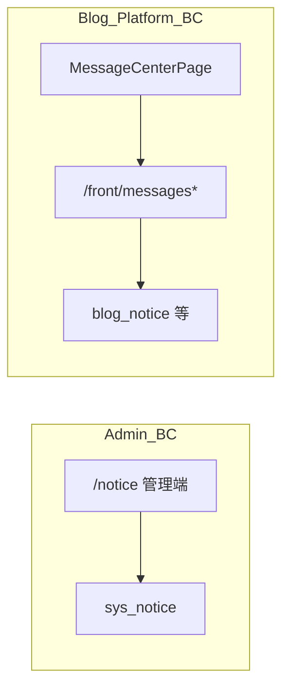
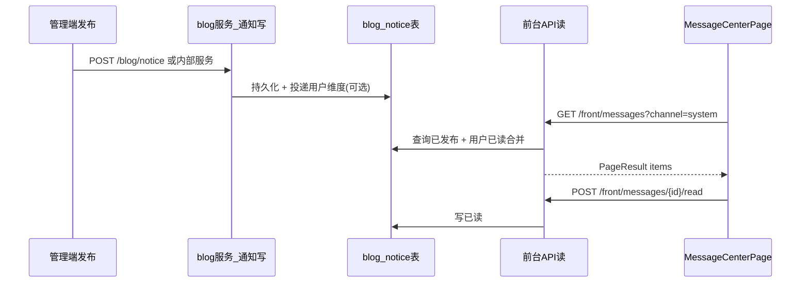

# 博客前台消息中心与「前台通知」完整闭环架构方案

> 角色：高级系统架构师视角  
> 决策前提：`system/notice`（`sys_notice`）仅服务后台管理；前台用户通过独立「博客通知」模块消费；立即切断 `FrontNoticeController → RemoteNoticeService` 旧链路；数据模型与后台公告表解耦。

---

## 1. 问题陈述与边界

### 1.1 现状矛盾

| 维度 | 当前行为 | 目标行为 |
|------|----------|----------|
| 数据来源 | 前台 `/front/notices` 经 Feign 读 `sourcelin-system` 已发布公告 | 前台只读博客域自有数据 |
| 语义 | 后台「通知公告」与前台「站务公告」混用 | 后台内部公告 ≠ 用户可见通知 |
| 用户模型 | 无真实「用户收件箱」；角标用列表条数占位 | 登录用户有未读/已读；游客可见公共广播类通知（可选） |

### 1.2 边界（Bounded Context）

- **Admin_BC**：运维/管理员面向的站内公告（可不面向访客）。
- **Blog_Platform_BC**：访客/注册用户面向的博客产品通知（站务、活动、互动摘要等）。

两上下文之间**禁止**再通过「读对方表」做隐式集成；若未来需要「一条内容两处发」，应通过显式领域事件或编排服务，不在本轮范围。

---

## 2. 目标架构（逻辑视图）

### 2.1 前台消息中心（已有 UI 壳）

现有页面：[`sourcelin-ui-platform/src/modules/notice/pages/MessageCenterPage.vue`](../../sourcelin-ui/sourcelin-ui-platform/src/modules/notice/pages/MessageCenterPage.vue)

- 频道定义：[`channels.ts`](../../sourcelin-ui/sourcelin-ui-platform/src/modules/notice/config/channels.ts) — `system | interaction | star | follow`。
- 当前仅 `system` 接真实数据（旧 `/front/notices`），其余为「即将」占位。

**融合原则**：保留频道与路由（`/messages`），替换 **system 频道** 的数据源为博客域通知 API；其余频道保持占位直至对应业务事件源就绪。

### 2.2 端到端数据流（闭环）

---

## 3. 数据模型（物理视图）

### 3.1 主表：`blog_notice`（建议）

| 字段 | 类型 | 说明 |
|------|------|------|
| id | bigint PK | 通知主键 |
| title | varchar(200) | 标题 |
| content | mediumtext/longblob | 富文本 HTML（与现有编辑器一致时注意 XSS 策略） |
| channel | varchar(32) | `system` / 预留与前端频道对齐；互动类也可走独立表 |
| notice_type | tinyint | 业务子类型：站务/活动/互动摘要等（字典可后续补） |
| status | char(1) | `0` 发布 `1` 下线（与项目习惯对齐） |
| publish_time | datetime | 发布时间 |
| target_scope | varchar(16) | `all` 全体 / `login` 仅登录 / `user_ids` 指定（若做定向） |
| create_by / create_time / update_by / update_time | | 审计 |
| deleted | int | 软删除（与仓库惯例一致） |

说明：**不与 `sys_notice` 共用表**，避免权限与展示规则纠缠。

### 3.2 用户态：`blog_notice_read`（或 `blog_user_notice_state`）

| 字段 | 说明 |
|------|------|
| user_id | 用户 ID |
| notice_id | 通知 ID |
| read_time | 已读时间 |
| UK(user_id, notice_id) | 幂等已读 |

未登录用户：**不写入**已读表；前端「移除」仅本地状态或不做持久化。

### 3.3 与 `sys_notice_read` 的关系

仓库已有 `sys_notice_read` 表（历史种子），**本轮不强行复用**：该表语义绑定 system 公告。博客前台已读后应落在 `blog_*`，避免跨服务外键与职责污染。

---

## 4. API 契约（博客服务）

### 4.1 前缀与响应

- 浏览器 JSON 统一走 `ApiResponse` 包装（项目既有 `ApiResponseBodyAdvice`）。
- 列表分页统一 `PageResult<T>`（`page` / `pageSize` 请求参数与全项目 canonical 对齐）。

### 4.2 前台只读（`/front`）

| 方法 | 路径 | 说明 |
|------|------|------|
| GET | `/front/messages` | 分页列表，`channel`、`page`、`pageSize`；登录时合并已读态 |
| GET | `/front/messages/{id}` | 详情；仅 `status=发布` |
| POST | `/front/messages/{id}/read` | 标记已读（需登录） |
| POST | `/front/messages/read-all` | 按 `channel` 或全局批量已读（需登录） |
| GET | `/front/messages/unread-count` | 顶栏红点（需登录） |

**切断旧链路**：`GET /front/notices` 要么删除，要么返回 410/空列表并文档声明废弃；与产品确认的「立即切断」一致时，建议直接改为内部转发到新查询（仅 `system` 频道映射）以减少前端大爆炸，但**不得再调用 system 服务 Feign**。

### 4.3 管理端写入（`/blog` 或 `/system` 下的 blog 菜单）

建议通知发布落在 **blog 模块管理端**（如 `BlogNoticeController` under `/blog/notice`），权限串 `blog:notice:*`，与 `system:notice:*` 分离。

---

## 5. 与 `MessageCenterPage` 的映射

| 前端 channel | 首期数据源 | 说明 |
|----------------|------------|------|
| system | `blog_notice.channel=system` | 站务/活动类广播 |
| interaction | 占位 | 后续对接评论/回复事件 |
| star | 占位 | 后续对接赞/收藏事件 |
| follow | 占位 | 后续对接关注事件 |

`useMessageCenter.ts` 改造点：

- 按 `activeChannel` 调用 `/front/messages`，不再调用 `getNotices()` → `/front/notices`。
- `message-inbox-badge.store.ts`：未读数来自 `/front/messages/unread-count`，而非公告条数。

---

## 6. 安全与合规

- **内容安全**：富文本入库与出库需与现有 XSS 策略一致（后台 `SysNotice` 有 `@Xss`，新实体应对齐）。
- **鉴权**：Sa-Token 规则在 Nacos/文档中已有 `/front/notices` 匿名白名单；新接口需明确「列表/详情是否允许匿名」——建议：**列表/详情匿名可读广播类**，**已读接口必须登录**。
- **越权**：详情 ID 必须校验 `status`、软删除与用户可见范围（`target_scope`）。

---

## 7. 发布与运维闭环

### 7.1 配置与开关

- 功能开关（可选）：`blog.notice.enabled` — 便于灰度。
- 文档：更新 [`docs/blog-api-url-matrix.md`](../blog-api-url-matrix.md) 与 Sa-Token 白名单清单。

### 7.2 可观测性

- 关键操作打日志：发布、下线、已读批量。
- 指标（可选）：`blog_notice_publish_total`、`front_message_read_total`。

### 7.3 回滚

- DB 迁移可逆：新表 drop 前需确认无生产数据依赖。
- 应用回滚：保留旧 `FrontNoticeController` 代码分支仅在紧急恢复时启用（不推荐长期双轨）。

---

## 8. 分阶段落地（可验收）

### 阶段 A — 数据与控制面

1. DDL：`blog_notice`、`blog_notice_read` + 索引。
2. blog 模块：Entity、Mapper、Service、Controller（前台 + 管理端最小集）。
3. 删除或改写 `FrontNoticeController` 对 `RemoteNoticeService` 的依赖。

### 阶段 B — 前台融合

1. `notice.api.ts` / `useMessageCenter.ts` / badge store 切换新 API。
2. 首页跑马灯若需展示广播：从 `blog_notice` 拉取摘要字段或独立配置（与 `useHomePage` 的 `notice` 字符串列表策略对齐产品）。

### 阶段 C — 互动频道

1. 事件表或统一 `user_message` 聚合表；与 `channels.ts` 扩展对齐。

---

## 9. 验收标准（Definition of Done）

1. 后台 `system/notice` 发布内容**不出现在**前台消息中心 / 旧 `/front/notices` 路径（若保留则不再指向 system）。
2. 前台消息中心 `system` 频道数据**仅来自** `blog_notice`（或等价 blog 域表）。
3. 登录用户：未读数、已读、全部已读与 DB 一致；刷新页面状态不丢。
4. 权限：`blog:notice:*` 与 `system:notice:*` 菜单与接口互不串台。
5. 文档与冒烟脚本更新（如 `scripts/blog-api-smoke.mjs` 替换/新增路径）。

---

## 10. 风险与非目标

| 风险 | 缓解 |
|------|------|
| 运营习惯在 system 公告发前台内容 | 培训 + 管理 UI 明确标题「后台内部公告」；可选一次性数据导出脚本 |
| 富文本存储过大 | 限制长度、CDN 静态资源外链 |
| 未读风暴 | 批量已读限流、异步 |

**非目标（本轮不做）**：跨微服务统一消息总线、站内信实时推送（WebSocket）、第三方渠道（邮件/短信）。

---

## 11. 文档与代码索引（实施时对照）

| 项 | 路径 |
|----|------|
| 旧前台入口 | `sourcelin-modules/sourcelin-blog/.../FrontNoticeController.java` |
| Feign | `sourcelin-api-system/.../RemoteNoticeService.java` |
| 消息中心页 | `sourcelin-ui-platform/src/modules/notice/pages/MessageCenterPage.vue` |
| 频道配置 | `sourcelin-ui-platform/src/modules/notice/config/channels.ts` |
| 白名单参考 | `docs/configs/sa-token-nacos-configs.md` |

---

**版本**：2026-04-16  
**状态**：架构定稿，待进入阶段 A 实施。
