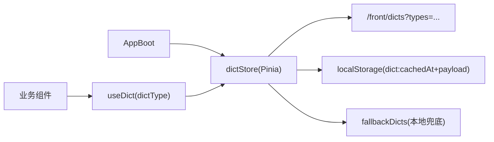

# 面向 `sourcelin-ui-platform` 的前台字典处理升级方案

> 设计目标：按“可落地、可回滚、可验收”推进前台字典体系升级。  
> 参考实践：BFF 字典聚合、客户端缓存、降级兜底、TTL 失效。

## 1) 现状与问题

当前前台是“本地硬编码枚举”模式，不是“动态字典加载”模式，主要问题如下：

- 状态文案散落在组件内（如文章状态、评论审核状态）。
- 文案与后端/管理端字典可能漂移。
- 新增/调整状态需要改多处代码并发版。
- 无统一缓存与失效策略，无法做到运行时热更新。

## 2) 目标（闭环定义）

将前台字典体系升级为：**服务端字典 + 前台缓存 + 统一消费层 + 兜底降级**。

达成后：

- 前台展示优先读取远端字典（与后台同源）。
- 组件不再硬编码 `label/tag`。
- 字典可按 TTL 自动刷新。
- 接口失败时有本地 `fallback`，不阻塞页面渲染。
- 具备监控、验收与回滚方案。

## 3) 推荐架构（前台最佳实践简化版）

核心原则：

- 单一入口：所有字典读取只能走 `useDict()` / `dictStore`。
- 单一来源优先级：**远端 > 本地缓存 > fallback 常量**。
- 按需预加载：启动只拉核心字典，页面进入时补拉业务字典。

## 4) 具体落地方案（分层）

### A. 后端/BFF（建议新增前台字典聚合接口）

在博客服务提供前台只读接口（不直接暴露 system 复杂接口）：

- `GET /front/dicts?types=blog_status,blog_comment_audit_status,...`

返回结构建议：

- `dictType`
- `items[]: { value, label, tagType, sort, enabled }`
- `updatedAt`（可选）

可选增强：

- `GET /front/dicts/updated-at` 返回最新更新时间，用于前台轻量判断是否需要提前刷新（可选，当前未实现）。

### B. 前台 API 层

新增文件：

- `src/modules/dict/api/dict.service.ts`
  - `getDicts(dictTypes: string[])`（批量）
  - `getDictItemsByType(dictType)`（单次）

约束：

- 所有页面禁止直接请求字典接口，必须经 `store/composable` 统一调用。

### C. 前台 Store 层（Pinia）

新增：

- `src/stores/dict.store.ts`

职责：

- `state`: `dictMap`, `loadingTypes`, `cachedAt`, `missingDictTypes`
- `actions`:
  - `ensureDicts(types)`
  - `getDictItems(type)`
  - `resolveLabel(type, value)`
  - `resolveTagType(type, value)`
  - `hydrateFromCache()`
  - `persistToCache()`

缓存键建议：

- `platform:dict-cache`（缓存体含 `cachedAt` + `dictMap`）

TTL 建议：

- 默认 `10min`，可按环境调整。

### D. Composable 层

新增：

- `src/shared/composables/useDict.ts`

导出：

- `useDict(dictType) -> { options, labelOf, tagOf, ready, reload }`
- `useDicts(dictTypes[]) -> 批量模式`

这样业务组件只关心“要哪个 `dictType`”，不关心加载细节。

### E. 组件改造策略（先高频）

第一批改造（收益最大）：

- `UserArticleList.vue`（文章状态）
- `SCommentStatusTag.vue`（评论审核状态）
- 其他状态展示组件（统一替换 `resolveStatusLabel/if-else`）

改造后组件内不再写 `if (status===1) ...`，统一使用 `labelOf(status)` / `tagOf(status)` 派生文案与样式。

### F. 兜底与非兼容策略

新增本地兜底文件：

- `src/shared/constants/fallback-dicts.ts`

仅保留关键字典（防接口失败）：

- `blog_status`
- `blog_comment_audit_status`
- `blog_yes_no`（如需）

这样即使后端字典接口短时不可用，页面仍可展示可读文案。

不兼容历史数据策略：

- 本次升级直接切断旧缓存结构，不做历史缓存格式兼容解析。
- 缓存键统一为 `platform:dict-cache`，旧结构缓存不再纳入读取逻辑。
- 旧缓存数据不读取，按新结构重建。

## 5) 迁移计划（可执行）

### 阶段 1：基础能力

- 新增 `dict API + store + useDict`
- 接入缓存与 TTL 校验
- 打通启动时核心字典预加载

### 阶段 2：高频页面替换

- 替换文章状态、评论状态等核心场景
- 清理对应硬编码函数

### 阶段 3：全量治理

- 全仓检索状态硬编码并替换
- 形成“禁止新增硬编码字典”的 lint 规则/代码规范

### 阶段 4：验收与收口

- 联调回归 + 异常演练（接口失败/缓存过期）
- 补文档与开发约束

## 6) 验收标准（闭环）

必须全部满足：

- 前台核心状态展示全部来自 `dictStore/useDict`。
- `rg` 检索不到新增散落的状态硬编码函数（或白名单可控）。
- 字典接口失败时页面仍可展示（`fallback` 生效）。
- TTL 到期后可自动刷新缓存。
- 首屏性能可控（核心字典预加载不超过约定时长）。

## 7) 风险与控制

### 风险 1：字典值域不一致（数字/字符串）

- 方案：`store` 层统一 `String(value)` 比较，做类型归一化。

### 风险 2：首屏请求增多

- 方案：核心字典预加载 + 非核心按需加载。

### 风险 3：后端字典变更导致前台旧缓存脏读

- 方案：缩短 TTL + 关键页面按需刷新（必要时增加更新时间接口）。

### 风险 4：迁移期双轨混用

- 方案：设置迁移开关与灰度名单，逐页切换。

## 8) 参考优秀实践映射

本方案对齐成熟前台常见模式：

- BFF 聚合字典接口：减少前台直接依赖系统服务细节。
- Store 中央缓存：避免页面重复拉取。
- Composable 抽象：业务组件只消费，不感知来源。
- Fallback 常量：保障可用性。
- TTL 失效：以低复杂度保障一致性与运维可控。

---

如果该方案确认通过，下一步输出项目定制版实施清单（精确到文件路径与改造点），并按“先文章状态 + 评论状态”执行落地。

## 9) 当前落地进展与差异清单（2026-04-16）

### 9.1 已完成（与方案对齐）

- 前台字典 API 已落地：`src/modules/dict/api/dict.service.ts`
  - 已支持按 `dictType` 拉取远端字典项。
  - 已支持 `getDicts(dictTypes[])` 批量拉取能力（前台侧聚合）。
  - 已切换为前台域接口 `/front/dicts`，不再调用 `/system/*`。
- 前台字典 Store 已落地：`src/stores/dict.store.ts`
  - 已支持 `dictMap`、`ensureDict/ensureDicts`、`resolveLabel/resolveTagType`。
  - 已支持 `localStorage` 缓存与 fallback 降级链路。
  - 已支持 TTL 缓存（`cachedAt + dictMap`，默认 `10min`）。
  - 已在降级分支增加观测日志（批量/单次加载失败、远端空字典）。
- 前台字典 Composable 已落地：`src/shared/composables/useDict.ts`
  - 业务组件可通过 `useDict(dictType)` 统一消费。
- 启动预加载已落地：`src/app/main.ts`
  - 预加载 `blog_status`、`blog_comment_audit_status`。
- 首批高频页面已改造：
  - `src/modules/user/components/UserArticleList.vue`
  - `src/shared/components/ui/SCommentStatusTag.vue`
  - `src/modules/user/composables/useUserCenter.ts` 删除提示文案改为字典动态解析。

- 后端 /front/dicts 聚合接口已落地（canonical 字段输出）：
  - `sourcelin-modules/sourcelin-blog/src/main/java/com/sourcelin/blog/controller/front/FrontDictController.java`
  - system 侧 Feign：`sourcelin-api/sourcelin-api-system/src/main/java/com/sourcelin/system/api/service/RemoteSysDictDataService.java`
  - 返回字段：`value/label/tagType/sort/enabled`

### 9.2 待补齐（与目标仍有差距）

- TTL 失效已落地（需补验收）：
  - 当前缓存键为 `platform:dict-cache`。
  - 缓存体包含 `cachedAt + dictMap`，默认 TTL `10min`。
  - 旧缓存结构不兼容，不参与读取。
- 监控与告警部分落地（基础日志）：
  - 已有 console 级观测日志。
  - 尚未接入统一上报链路（如埋点/告警平台）。
- 全量页面替换未完成：
  - 仅完成第一批高频组件，仍需继续清理其他散落状态映射（提高 rg 检索命中质量）。
- 故障演练与回归验收待执行：
  - 接口失败：fallback 是否符合预期
  - TTL 过期：是否按计划刷新
  - 返回缺项：是否仍可展示兜底文案

### 9.3 下一步执行顺序（建议）

1. 接入统一上报链路（当前仅 console 级观测）。  
2. 批量替换剩余状态硬编码组件，并加 lint 规则禁止新增硬编码映射。  
3. 执行故障演练（接口失败、缓存过期、字典缺项）与回归验收。  
