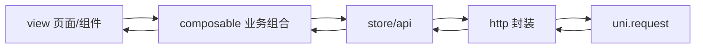

# Sourcelin Blog Uniapp 移动端开发拆解文档

> 版本：v1.3
> 日期：2026-05-28
> 适用范围：Sourcelin Blog Uniapp 微信小程序与 H5 移动端
> 依据文档：`docs/product/UNIAPP_MINI_PROGRAM_PRODUCT_DESIGN.md` v1.1、`rules/api-contract.md`、`rules/frontend-platform.md`、`AGENTS.md` 第 4/8 节

## 一、文档定位

本文档是产品方案 PRD 的工程化补充，仅承接 PRD 第 2/3/4 章，不重复阐述产品立意、视觉规范与交互细节。读者应已通读 PRD，本文聚焦四件事：

1. 把 PRD 中的页面/功能切分成可独立交付的开发模块。
2. 给出请求、状态、组件复用等技术方案的工程边界。
3. 用 P0/P1/P2 与里程碑的二维矩阵明确开发顺序。
4. 列出潜在技术风险与规避手段。

当前仓库已存在 `sourcelin-ui/sourcelin-ui-uniapp` M0 脚手架，因此本文档不再按“从 0 创建项目”推进，而是作为现有实现的整改和后续交付基准。后端接口实现、Mock 服务、规则与技能落地仍不在本文档直接修改范围。

### 1.1 当前实施检查结论（2026-05-28）

| 检查项 | 当前实现 | 结论 | 处理要求 |
|---|---|---|---|
| 工程存在性 | 已有 `sourcelin-ui/sourcelin-ui-uniapp`，包含 Vue 3、TS、Vite、Pinia 与 Uniapp 构建脚本 | 工程基线稳定 | 后续继续在现有工程内演进 |
| Tab 与主路径 | 首页、发现、社区、我的四个 Tab 已有真实页面内容与业务跳转 | 不再是单纯骨架 | 保持主路径稳定，避免无关入口膨胀 |
| 分包页面 | `pages-article`、`pages-user`、`pages-messages`、`pages-about`、`pages-publish` 已注册，消息、导航、树洞、说说发布、资料编辑等页面均已有真实实现 | 路由可达性成立 | 后续以真机体验和接口联调为主 |
| 请求分层 | 已有 `src/utils/request.ts`、共享类型、业务域 API 与分页 composable | 分层方向基本正确 | 新增能力继续向统一边界收口，不回退到页面直连请求 |
| API 契约类型 | `ApiResponse`、`PageResult`、`ListResult` 已进入共享类型层 | 契约方向正确 | 继续检查新增页面是否误用旧字段 |
| 首页能力 | 首页已有搜索入口、公告轮播、推荐/最新内容和刷新加载逻辑 | 阅读首页已可用 | 继续打磨卡片层级和聚合内容质量 |
| 发现与搜索 | 发现页已有热门文章、分类入口和搜索跳转；搜索页已有关键词搜索、分类/标签聚合、热门搜索、搜索建议和搜索历史 | 搜索与发现闭环成立 | 后续只做体验与性能打磨 |
| 社区能力 | 社区页已有说说/树洞列表、点赞、收藏、评论抽屉、举报入口；说说发布和树洞投递页面已落地 | 基础社区与轻发布闭环成立 | 继续关注审核状态提示和真实数据质量 |
| 用户资产 | 登录、微信快捷登录、资料展示/编辑、头像上传、收藏、关注、我的文章、消息中心已有入口和页面 | 用户资产闭环成立 | 后续重点做真机联调和异常态补充 |
| 占位页面 | 未检出“建设中”占位页面 | 不再阻断阶段闭环判断 | 新增页面必须避免空占位进入验收范围 |
| 后端接口实现 | `/front/messages`、`/front/reports`、`/front/analytics/events`、`/front/articles` 发布/编辑、`/auth/wechat/mini/login|prepare-bind|bind` 均已在后端实现 | 按已实现处理 | 线上环境仍需用真实账号做最终 HTTP 联调记录 |
| 订阅消息授权 | 已新增 `/front/subscriptions/authorizations` 后端记录接口、SQL 表和移动端体验设置入口 | P1 缺口已补齐 | 微信模板 ID 从微信公众平台/小程序后台“订阅消息 -> 我的模板”获取，按环境配置到 `src/config/env.ts.subscribeMessageTemplateIds` 后即可触发真实授权 |
| 生成产物 | 工程内已有 `node_modules`、`dist`，但被子项目 `.gitignore` 忽略 | 不应提交 | 提交前执行公开边界检查，确保生成产物不进入版本库 |
| 小程序 AppID | `manifest.json` 已改为占位 AppID，本地开发/构建通过 `.env.local` 临时注入真实值 | 公开分支风险已收口 | 继续保持真实 AppID 不进入公开仓库 |
| 质量门禁 | 2026-05-28 已执行 `npm run lint`、`npm run type-check`、`npm run build:mp-weixin`、`npm run build:h5`、`mvn compile -pl sourcelin-modules/sourcelin-blog -am` | 移动端与博客后端基础质量门禁通过 | 后续发布前补充真机和线上账号验收记录 |
| 发现页底部白条 | 暗色模式真机底部细线仍需后续视觉专项收口 | 暂不纳入当前验收范围 | 后续单独处理并以真机截图验收 |

实施判断：当前代码已经完成产品与技术准备、基础框架、内容阅读、搜索与互动、用户资产、社区扩展、H5 基础 SEO 和接口实现验收的主要功能闭环。剩余工作以订阅模板配置和发布前专项记录为主，不再存在页面空缺或主链路断点。

### 1.2 当前阶段进度确认

- [x] 产品与技术准备
  - 依据：产品方案、登录策略、工程入口、阶段拆解文档均已形成。
- [x] 基础框架
  - 依据：TabBar、路由注册、请求层、共享类型和业务域目录边界已落地。
- [x] 内容阅读
  - 依据：首页、发现、文章列表、文章详情已具备完整阅读主路径。
- [x] 搜索与互动
  - 依据：搜索联想、热搜/历史、分类/标签聚合搜索、点赞、收藏、关注、评论抽屉和举报入口均已落地。
- [x] 用户资产
  - 依据：资料编辑、头像上传、消息中心、收藏、关注、我的文章和微信快捷登录均已落地。
- [x] 社区扩展
  - 依据：说说列表/发布、树洞列表/投递、友链、导航、关于页面均已有真实实现。
- [x] 兼容与性能
  - 依据：构建验证通过；真机性能已确认无阻断问题，离线阅读与虚拟列表不纳入当前闭环，发现页底部白条暂不列入当前验收范围。
- [x] 联调验收
  - 依据：本轮已按源码确认 `/front/messages`、`/front/reports`、`/front/analytics/events`、文章发布/编辑、微信快捷登录和订阅授权记录接口均已实现，并完成移动端与博客后端构建验证；线上真实账号 HTTP 验证作为发布前专项记录，不再阻断当前功能闭环。

约束：只有阶段被标记为已完成，且不存在同阶段“建设中”占位、关键交互缺口或验收证据缺失，才允许生成对应推文。

## 二、功能模块拆分

### 2.1 双视角拆分原则

模块拆分采用页面视角与业务域视角双重切片：

- 页面视角决定目录边界与分包策略，影响主包体积、跳转关系和首屏可达性。
- 业务域视角决定 `src/modules/<domain>/**` 的代码归属，影响 API、composable、状态、类型的归集方式。
- 两套视角必须匹配 PRD 第 4.1 节的目录结构，业务页面只写编排，不写业务实现。

### 2.2 页面视角：主包与分包边界

主包仅承载 TabBar 四页与登录引导，保证小程序冷启动体积可控（PRD 第 5.3 节验收：主包 ≤ 2MB）。

| 类型 | 包路径 | 页面 | 说明 |
|---|---|---|---|
| 主包 | `pages/home` | `home.vue` | 首屏内容分发，PRD 第 3.3.1 节；当前已存在，需重构为聚合流 |
| 主包 | `pages/discover` | `discover.vue` | 搜索/热门/分类，PRD 第 3.3.2 节；当前已存在，需接入真实数据 |
| 主包 | `pages/community` | `community.vue` | 说说与树洞分段，PRD 第 3.3.5 节；当前已存在，需补列表 |
| 主包 | `pages/mine` | `mine.vue` | 用户资产入口，PRD 第 3.3.7 节；当前已存在，需修复分包跳转 |
| 分包 | `pages-article` | `detail.vue` / `list.vue` / `search.vue` | 文章详情、文章列表、搜索，PRD 第 3.3.3-3.3.4 节 |
| 分包 | `pages-user` | `login.vue` / `profile.vue` / `collects.vue` / `follows.vue` / `articles.vue` / `home.vue` | 登录与用户资产二级页 |
| 分包 | `pages-messages` | `index.vue` / `detail.vue` | 消息频道，PRD 第 3.3.6 节 |
| 分包 | `pages-about` | `index.vue` / `links.vue` / `navigation.vue` | 站点补充能力 |
| 分包 | `pages-publish` | `say.vue` / `treehole.vue` | P1 轻发布与匿名投递 |

### 2.3 业务域视角：模块归属

业务域目录与 Web 前台 `sourcelin-ui-platform/src/modules/**` 命名保持一致，便于跨端认知。

| 业务域 | 模块职责 | 关键页面 | 主要接口前缀 |
|---|---|---|---|
| article | 文章发现、详情、搜索、归档 | home / discover / article-list / article-detail | `/front/articles`、`/front/articles/search`、`/front/categories`、`/front/tags`、`/front/hot/**` |
| interaction | 点赞、收藏、关注/粉丝 | 详情底栏、collects、follows | `/front/interactions/**`、`/front/follows`、`/front/users/follow*` |
| comment | 评论列表、发布、回复、点赞、删除 | 评论抽屉 | `/front/comments` |
| say | 说说浏览与发布 | community 说说段、publish/say | `/front/says` |
| treehole | 树洞匿名表达 | community 树洞段、publish/treehole | `/front/treeholes` |
| user | 登录、资料、头像、用户主页、我的文章 | mine、profile、avatar、user/home | `/front/user/**`、`/front/users/**`、`/auth/**` |
| message | 系统公告、互动通知频道、未读 | messages | `/front/messages` |
| site | 站点信息、友链、导航、关于、公告 | home 顶部公告、about、links、navigation | `/front/links`、`/front/navigation`、`/front/config/about` |
| platform | 跨域基础设施：请求、缓存、上传、分享、登录引导、登录续做、错误处理 | 全局 | 不直接对应业务接口 |

### 2.4 模块边界硬约束

- 业务页面（`pages/**`、`pages-*/*`）仅做编排：调用 composable、传 props、装配组件。
- 数据请求只在 `src/modules/<domain>/api/*.api.ts`，禁止页面直连 `uni.request`。
- 现有 `src/utils/request.ts` 在 M1 阶段允许作为迁移源保留，但业务页面不得继续新增直接调用；完成迁移后统一下沉到 `src/shared/**`。
- 跨业务域共享的请求、缓存、登录、上传、分享逻辑下沉到 `src/shared/**`，不放业务域。
- 评论、点赞、收藏的 `targetType` 取值 `article|say|treehole`，禁止散落字符串字面量，统一封装枚举。

## 三、技术方案大纲

### 3.1 数据流转逻辑

整体采用单向数据流：



关键编排：

1. 列表分页：所有列表页通过 `createPagingQuery<T>()` 输出 `items / total / page / pageSize / totalPages / loading / finished / error / refresh / loadMore`。下拉刷新重置到首页，上拉加载在 `page < totalPages` 时递增。
2. 乐观更新：点赞、收藏、关注先更新 UI 状态与计数，再调用接口；接口失败时回滚到操作前的快照，并展示明确错误提示。写操作不进入自动重试队列，避免重复提交。
3. 登录续做：未登录用户触发需登录操作时，把 `pendingAction` 入队（包含目标接口、参数、回调），弹出半屏登录；登录成功后由 `pendingAction.store` 串行重放，重放失败仅提示一次。
4. 阅读进度（P1）：本地缓存 `articleId / scrollTop / readingMs / updatedAt`，再次进入同一文章时由用户确认后定位，禁止自动跳转。
5. 列表返回快照：从详情页 back 时通过 `feed.store.scrollTopMap` 恢复对应列表的滚动位置与筛选状态。

### 3.2 接口请求方式

请求层只允许一个入口 `src/shared/api/http.ts`，对外导出两个原语：

- `requestData<T>(options): Promise<T>`，封装 `uni.request`，自动解 `ApiResponse<T>`，仅返回 `data`；非 `code === 0` 抛出业务错误。
- `uploadFile<T>(options): Promise<T>`，封装 `uni.uploadFile`，复用同一套响应契约。

请求选项：

| 选项 | 用途 |
|---|---|
| `isToken` | 默认 `true` 注入 token；匿名接口显式 `false` |
| `skipErrorToast` | 业务自处理错误（如评论敏感词）时关闭统一 Toast |
| `skipAuthRedirect` | 401 时不弹登录引导（用于后台静默校验） |
| `signal` | 取消重复请求或路由切换中的过期请求 |
| `retry` | 仅 GET 列表允许 `retry: 1`，写操作禁用 |

错误码处理：

- `0`：成功，返回 `data`。
- `401`：清理 token，弹半屏登录引导（除非 `skipAuthRedirect`）。
- `403`：展示无权限态，不跳走。
- `429`：节流提示，附冷却时间。
- `5xx` / 网络错误：列表给可重试 UI；写操作只提示，不自动重放。

契约硬约束（来自 `rules/api-contract.md`）：

- 顶层只存在 `code / message / data / requestId / timestamp`，前端禁止消费 `msg / rows / records / list / pageNum / limit`，禁止判断 `code === 200`。
- 分页只读 `items / total / page / pageSize / totalPages` 五字段。
- API 类型在 `src/shared/types/api.ts` 集中定义 `ApiResponse<T>`、`PageResult<T>`、`IdResponse`、`ListResult<T>`，业务模块仅扩展业务 DTO。

### 3.3 状态管理方案

使用 Pinia，按"全局共享 vs 页面局部"严格区分。

| Store | 持久化 | 关键字段 | 说明 |
|---|---|---|---|
| `user.store` | `uni.setStorageSync` | `token / tokenName / tokenPrefix / userInfo / isLoggedIn` | 启动时恢复，登出清理 |
| `app.store` | 部分持久化 | `siteInfo / unreadCount / theme / launchReady` | siteInfo 缓存 1 小时 |
| `feed.store` | 内存 | `homeSnapshot / discoverSnapshot / scrollTopMap` | 当前会话有效，杀进程即清 |
| `draft.store` | 持久化 1 小时 | `sayDraft / treeholeDraft / commentDraftMap` | 提交成功后清理 |
| `pendingAction.store` | 内存 | 登录续做队列 | 登录成功后立即消费 |

边界规则：

- 弹层开关、列表分页参数、临时 loading 留在页面 composable，禁止进全局 store。
- 评论输入草稿按 `targetType + targetId` 维度落 `commentDraftMap`，避免页面切换串扰。
- store 中不直接调用 API；API 调用统一在业务域的 composable 或 api 层。

### 3.4 组件复用策略

UI 抽象层强制收敛 Liquid Glass Mobile 规范（PRD 第 3.1.1-3.1.5 节）。

基础层 `S*`（`src/shared/components/`）：

- `SButton`、`SInput`、`SAvatar`、`STag`、`SImage`、`SEmpty`、`SSkeleton`、`SBottomSheet`、`SCard`。
- `SCard` 支持 `variant: pure | tint | zen | outbound`，对应 PRD 三套杂志模板与 Zen 留白。

容器层（`src/shared/layouts/`）：

- `PageShell`：唯一的页面级光球与安全区生成节点，业务页面禁止重复创建背景光球。
- `ListPageShell`：内嵌 `SSkeleton` 与下拉刷新、上拉加载状态。
- `AuthGuardPanel`：半屏登录引导，承担 `pendingAction` 入队职责。

业务层（`src/modules/<domain>/components/`）：

- `ArticleCard`：通过 `layout: 'A' | 'B' | 'C'` 或 `index` 自动切换三套模板。
- `ArticleActionBar`：底部固定操作栏，承载点赞/收藏/评论/分享。
- `CommentSheet`：评论抽屉，跨 article/say/treehole 复用，按 `targetType` 切换。
- `SayCard`、`TreeholeCard`、`UserStatGrid`、`AuthorCard`。

强约束：

- 业务页面不得直写 `backdrop-filter`；`backdrop-filter` 仅在 H5 与 APP-PLUS 条件编译块启用。
- 业务组件不得自定义第二套玻璃 token（颜色、圆角、阴影），必须消费 `--sl-*` 全局变量。
- 长列表卡片禁止叠加 `filter / blur / box-shadow` 多层；层次差异通过 1rpx 渐变边框 + 低透明阴影表达。

## 四、开发优先级与里程碑映射

里程碑沿用 PRD 第 5 章 M1-M4，本文给出每个里程碑的工程交付清单与跨模块依赖。

### 4.1 P0 核心闭环（M1 + M2 + M3）

P0 的目标是一条最短可用路径："看内容 → 找内容 → 读详情 → 轻互动 → 收藏/关注回访"。

M1 工程基线：

- 在现有 `sourcelin-ui/sourcelin-ui-uniapp` 上完成 M0 清理：确认 `.gitignore` 覆盖 `node_modules/dist/unpackage`，真实 AppID 不进入公开分支，README 与实际 `src/pages.json`、`src/manifest.json` 路径一致。
- `src/shared/api/http.ts`、`uploadFile`、错误处理、token 注入。
- `src/shared/types/api.ts` 集中契约类型。
- `PageShell`、`SCard`、`SButton`、`SBottomSheet`、`SSkeleton`、`SEmpty` 基础抽象层。
- TabBar 四页骨架页 + 登录页 + 401 拦截。
- 补齐 `pages-user/login/login`、`pages-user/profile/profile` 等已被引用的路由，避免运行时跳转失败。
- 将现有页面内 `http.get` 迁移到业务域 `api + composable`，页面只保留展示编排。
- 补齐 ESLint 9 扁平配置或调整工具链版本，保证 `npm run lint` 可作为提交前质量门禁。

M2 阅读闭环：

- `home`、`discover`、`article-list`、`article-detail`、`search` 页面与对应 composable。
- 文章详情富文本渲染层、代码块横向滚动、图片预览。
- 列表返回滚动位置恢复。
- 分享 `onShareAppMessage` 路径与首次落地引导。

M3 互动闭环：

- 点赞/收藏/关注乐观更新与回滚。
- `CommentSheet` 与评论发布、回复、自删除、点赞。
- 半屏登录引导 + `pendingAction` 续做。
- `mine` + 我的收藏 + 我的关注只读 + 头像展示（不含上传）。
- 说说基础列表与互动。

### 4.2 P1 扩展能力（M4）

- 树洞广场、匿名投递、草稿暂存（1 小时）。
- 举报入口（小程序端已完成举报入库；后台管理查询、处理和删除闭环由后台会话负责，不作为小程序侧阻断项）。
- 消息频道与未读数：系统公告、评论回复、点赞收藏、关注。
- 粉丝列表、用户主页、轻发布说说、头像上传。
- 阅读进度恢复、订阅消息授权记录。
- 友链、导航、关于二级入口。
- 微信小程序登录与绑定已有账号（前后端代码已落地，配置中心需提供 `appId/appSecret` 并完成线上联调）。
- 订阅消息授权记录（已新增移动端授权入口和 `/front/subscriptions/authorizations` 记录接口；微信模板 ID 未配置时入口给出明确提示，不触发授权弹窗）。

### 4.3 P2 发布质量与体验深化

当前 P2 不再按“功能堆叠”推进，而是聚焦可验证的发布质量、真实体验和运营数据闭环。

可继续执行：

- 原生分享闭环：文章、社区、用户主页、首页和发现页补齐 `onShareAppMessage` 标题、路径、封面与分享埋点；暂不做 canvas 分享海报。
- H5 基础 SEO：已实现 H5 运行时 `title`、`description`、`keywords` 注入，覆盖首页、发现、社区、我的、文章详情、搜索、文章列表、用户主页和关于页；不做 SSR、静态化或服务端渲染。
- 埋点与轻推荐证据化：保留 `POST /front/analytics/events`，补齐阅读、搜索、分享、互动、举报、发布等关键事件清单和验证记录。
- 性能验收记录：真机已确认当前阶段无阻断问题，记录表保留为发布前补充证据；不因当前版本去引入离线阅读或默认虚拟列表。
- 公开发布边界：真实 AppID 本地注入、敏感信息扫描、`dist/node_modules/unpackage` 不提交。
- 视觉专项收口：暗色主题穿帮、底部安全区、关键页面按钮/卡片一致性；发现页底部白条单独以真机截图验收。

延期或不做：

- AI 摘要：等待后台 AI 生成、审核和回填服务完成后再接入。
- 离线阅读：当前不做，避免缓存一致性和内容过期成本。
- 虚拟列表：不预设启用，仅真机长列表性能不达标时作为专项方案。
- 分享海报：下调为运营专项，待模板设计、保存授权和 canvas 兼容边界明确后再做。

### 4.4 优先级硬规则

- P0 不依赖任何后端新增接口，仅消费 PRD 附录现有 `/front/**` 与 `/auth/**`。
- P0 不引入富文本编辑、海报生成、AI 能力等高复杂度依赖。
- 任何 P1/P2 能力上线前需确认后端接口、契约与审核流程，未就绪一律降级或不展示入口。
- P2 不把“后台未完成能力”包装成前端已完成能力；AI 摘要、后台举报管理、海报运营模板等外部依赖必须显式延期。

## 五、潜在技术风险与规避建议

| 类别 | 风险 | 规避建议 |
|---|---|---|
| 富文本 | `rich-text` 样式/代码块/表格降级 | 内容转换层 + 自定义代码块组件，P0 先 HTML 白名单清洗；P1 再评估 `uni-markdown` 等轻量库 |
| 外链跳转 | 小程序业务域名白名单限制 | 默认复制链接 + Toast 提示；白名单内走 `web-view`；H5 直跳 |
| 登录差异 | 微信快捷登录依赖配置中心的 `appId/appSecret` 与微信合法域名 | 已补 `/auth/wechat/mini/login`、`/auth/wechat/mini/bind`；联调前补齐认证配置和微信域名 |
| 上传适配 | Web `FormData` 与 `uni.uploadFile` 行为不一致 | 单独 `uploadAdapter`，统一解析 `ApiResponse<T>`、限制大小与格式 |
| 长列表性能 | 图片 + 滤镜导致滚动卡顿 | 缩略图、懒加载、骨架屏、避免叠加 filter；不预设虚拟列表，真机不达标再启用 |
| 字段语义遗留 | 评论 `articleId` 复用承载 say/treehole | 前端内部统一 `targetId / targetType`，请求适配层映射为后端字段 |
| 主包体积 | uview-plus、富文本库进入主包 | 按需引入 + 文章详情/用户/社区分包 + 远程 CDN 图片 |
| 玻璃性能 | 大面积 `backdrop-filter` 掉帧 | 伪玻璃面板 + 1rpx 渐变边框 + 低透明阴影；模糊仅条件编译启用 |
| 契约一致性 | 误用 `msg / rows / records / code === 200` | http 层强类型化 + 联调与提交前的契约审查清单 |
| 审核合规 | 隐私政策、授权说明、内容安全说明不齐 | 第 1 周输出合规清单；举报入口上线时同步回归后台内容举报处理闭环 |
| 真机适配 | 安全区、键盘顶起、胶囊遮挡 | 第 2 周起每周真机回归，不集中到末期 |
| 联调阻塞 | 个别后端接口未就绪 | 前端 Mock 层严格遵守 `ApiResponse / PageResult` 契约，联调完成后关闭 |
| 状态串扰 | 临时 loading/弹层进全局 store | 状态边界写入代码评审清单，全局 store 只放共享与持久化字段 |

## 六、交付清单与验收

### 6.1 工程目录蓝图

参考 PRD 第 4.1 节，工程化补充如下，作为最终落地蓝图：

```text
sourcelin-ui/sourcelin-ui-uniapp/
  src/
    pages/
      home/home.vue
      discover/discover.vue
      community/community.vue
      mine/mine.vue
    pages-article/
      detail/detail.vue
      list/list.vue
      search/search.vue
    pages-user/
      login/login.vue
      profile/profile.vue
      collects/collects.vue
      follows/follows.vue
      articles/articles.vue
      home/home.vue
    pages-messages/
      index/index.vue
      detail/detail.vue
    pages-about/
      index/index.vue
      links/links.vue
      navigation/navigation.vue
    pages-publish/
      say/say.vue
      treehole/treehole.vue             # P1
    modules/
      article/{api,components,composables,types}/
      interaction/{api,composables,types}/
      comment/{api,components,composables,types}/
      say/{api,components,composables,types}/
      treehole/{api,components,composables,types}/
      user/{api,components,composables,types}/
      message/{api,composables,types}/
      site/{api,composables,types}/
    shared/
      api/http.ts
      api/upload.ts
      components/        # S* 基础抽象
      layouts/           # PageShell / ListPageShell / AuthGuardPanel
      types/api.ts
      utils/{auth,cache,share,glass}.ts
      enums/target-type.ts
    stores/
      user.store.ts
      app.store.ts
      feed.store.ts
      draft.store.ts
      pending-action.store.ts
```

### 6.2 接口矩阵

接口矩阵直接复用 PRD 附录"移动端接口复用矩阵"与"后续新增接口建议"，本文不重复罗列以避免漂移。每次 PRD 附录变更后，本文档无需同步修改。

### 6.3 验收口径

每个里程碑统一用四类验收点：

| 类别 | 验收要点 |
|---|---|
| 功能 | P0/P1 范围页面可走通核心链路，未登录可阅读与分享，登录后可互动 |
| 性能 | 首页冷启动 ≤ 3s；详情骨架/缓存 ≤ 2s；主包 ≤ 2MB；列表上拉无卡顿 |
| 契约 | 仅消费 `data` 解包结果；分页只读 `items/total/page/pageSize/totalPages`；无 `msg/rows/records/code===200` |
| 合规 | 隐私政策、用户协议、授权说明、敏感词与频控提示完整；外链与匿名投递有提示 |

## 七、整改路线与范围边界

### 7.1 下一轮必须优先处理

| 优先级 | 事项 | 验收标准 |
|---|---|---|
| P0 | 修复已引用但不存在的分包路由 | `mine` 中登录、资料、收藏、关注入口均可跳转到已注册页面 |
| P0 | 建立 Liquid Glass 基础层 | `variables.scss`、`uni.scss`、`PageShell`、`SCard` 使用 PRD 的 `--sl-*` token 与伪玻璃 mixin |
| P0 | 收敛请求架构 | 页面不再直接调用 `http.get/post`，所有业务请求进入 `modules/<domain>/api` 与 `composables` |
| P0 | 对齐 API 契约类型 | `ApiResponse/PageResult` 集中定义，禁止旧字段和 `code === 200`，`timestamp/requestId` 与后端契约保持一致 |
| P0 | 首页从普通列表升级为聚合流 | 首页具备搜索胶囊、推荐内容流、非对称卡片模板和下拉刷新 |
| P1 | 社区与发现页接真实数据 | 发现页具备热门/分类/搜索，社区页具备说说与树洞基础列表 |

### 7.2 暂不处理

- 不改动现有 Web 前台、管理后台和后端代码。
- 不提交 `node_modules`、`dist`、`unpackage` 等生成产物。
- 不在 P0 引入完整文章编辑、AI 摘要、分享海报、个性化推荐。
- 不在接口未就绪时展示订阅消息等强依赖后端新增能力的入口；举报能力小程序侧只承诺提交入库，后台管理闭环由后台会话负责。
- 不在当前 P2 引入离线阅读、默认虚拟列表和 AI 摘要；虚拟列表仅作为真机性能不达标时的备选方案。
- 不降低 PRD 的 Liquid Glass 目标效果；如果实现不足，应整改实现，而不是把产品方案降级为普通列表 UI。

### 7.3 P2 可执行待办

| 状态 | 事项 | 验收标准 |
|---|---|---|
| 已完成 | 原生分享闭环 | 首页、发现、社区、文章详情、用户主页均有明确分享标题、路径和埋点；不依赖海报 |
| 已完成 | 埋点事件清单 | 文档列出阅读、搜索、分享、互动、举报、发布、登录等事件名和触发页面 |
| 已完成 | H5 基础 SEO 实现 | 已新增共享 SEO 工具并覆盖首页、发现、社区、我的、文章详情、搜索、文章列表、用户主页和关于页 |
| 已完成 | 性能验收结论 | 真机性能已确认无阻断问题，性能记录模板保留为发布前补充材料 |
| 已完成 | AppID 公开边界 | `src/manifest.json` 使用占位，真实 AppID 只在本地 `.env.local` 与忽略产物中出现 |
| 后续专项 | 发现页暗色底部白条 | 后续以真机截图和样式原因定位单独验收 |
| 延期 | AI 摘要 | 等后台 AI 服务完成后再接 |
| 不做 | 离线阅读 | 当前版本不纳入闭环 |
| 条件触发 | 虚拟列表 | 真机长列表不达标时再启用 |
| 延期 | 分享海报 | 作为运营专项单独立项 |

#### 7.3.1 埋点事件清单

| 事件名 | 触发页面/场景 | 目标类型 |
|---|---|---|
| `home_share` | 首页右上菜单或系统分享 | page |
| `discover_share` | 发现页系统分享 | page |
| `community_share` | 社区页系统分享，携带当前 `says/treeholes` 分段 | say/treehole |
| `article_share` | 文章详情底部分享按钮或系统分享 | article |
| `user_home_share` | 用户主页系统分享 | user |
| `discover_view` | 发现页加载完成 | page |
| `discover_open_article` | 发现页进入文章详情 | article |
| `article_report_submit` | 文章详情提交举报 | article |
| `community_report_submit` | 社区内容提交举报 | say/treehole |
| `article_submit_review` | 写文章提交审核/更新送审 | article |
| `article_save_draft` | 写文章保存草稿 | article |
| `article_delete_draft` | 写文章删除草稿 | article |
| `search_submit` | 搜索页提交关键词 | search |

#### 7.3.2 H5 基础 SEO 实现

- H5 已新增共享 SEO 工具，统一注入 `title`、`description`、`keywords`。
- 文章详情优先使用文章标题作为页面标题；列表、发现、社区、我的等页面使用业务标题或动态数据标题。
- 当前已覆盖：首页、发现、社区、我的、文章详情、搜索、文章列表、用户主页、关于页。
- 搜索引擎收录能力以博客 Web 前台为主，小程序 H5 只作为移动访问补充，不承诺完整 SEO 效果。

#### 7.3.2.1 当前订阅模板映射

当前小程序前端已配置并展示一个订阅模板：

- 模板名：`留言回复通知`
- 模板 ID：`y24CeVVFAMDOvRrmMzp7TK4spP8QFG5eEeiT0pxXazM`
- 场景说明：`文章评论回复提醒`

建议后台发送字段按以下映射：

| 模板关键词 | 推荐业务字段 | 说明 |
|---|---|---|
| 文章标题 | `article.title` | 被回复评论所在文章标题 |
| 回复人 | `replyUser.nickname` | 新回复用户昵称 |
| 回复内容 | `reply.content` | 新回复的正文内容 |
| 留言时间 | `rootComment.createTime` | 用户原评论时间 |
| 留言内容 | `rootComment.content` | 用户原评论内容 |
| 回复时间 | `reply.createTime` | 本次回复创建时间 |

当前前端已完成：

- 设置页展示模板名称、场景说明、关键词和最近一次本地授权状态。
- 授权结果同时写入本地缓存和 `/front/subscriptions/authorizations` 记录接口。
- 后台消息实际发送仍由后端会话继续落地，前端不承担模板消息下发逻辑。

#### 7.3.3 性能验收记录模板

| 指标 | 目标 | 记录方式 | 当前状态 |
|---|---|---|---|
| 微信小程序主包体积 | 主包不超过 2MB | 微信开发者工具代码质量/构建产物 | 构建通过，发布前补充截图记录 |
| 首页冷启动 | 3s 内可见首屏内容 | 真机打开首页计时 | 真机确认无阻断，发布前补充量化截图 |
| 文章详情首屏 | 2s 内可见标题与骨架/正文 | 真机打开文章详情计时 | 真机确认无阻断，发布前补充量化截图 |
| 长列表滚动 | 上拉加载无明显掉帧 | 首页/发现/社区连续滚动观察 | 真机确认无阻断；不达标再评估虚拟列表 |
| 图片资源体积 | 单图小程序包内资源不超过 200KB | 微信开发者工具代码质量 | 已做压缩，发布前复扫 |
| 接口请求耗时 | 高频接口 P95 不超过 1.5s | 开发者工具 Network/线上网关日志 | 已完成功能联通，发布前补充线上耗时记录 |

## 八、实施问题清单

| 问题 | 严重级别 | 影响 | 建议动作 |
|---|---|---|---|
| 分包注册为空但页面已跳转分包路径 | 高 | 用户点击登录/资料入口会失败 | 立即补齐页面文件与 `pages.json` 注册 |
| 页面直接发请求并承载分页状态 | 中 | 后续复用、测试、登录续做和缓存难以治理 | 按业务域迁移到 api/composable |
| 视觉 token 未采用 Liquid Glass Mobile Spec | 中 | 产品方案的 UI 差异化无法体现 | 优先建设 `PageShell/SCard/ArticleCard` 后再扩展业务 |
| 首页接口与 PRD 首页聚合接口不一致 | 中 | 首页无法承载推荐、分类、站点公告等首屏体验 | 后端可用时接 `/front/home`，不可用时使用契约 Mock |
| `README.md` 描述根目录 `manifest.json/pages.json`，实际位于 `src/` | 低 | 新成员启动项目容易误解 | 更新 README 或在开发文档注明实际路径 |
| 真实 AppID 出现在 `manifest.json` | 中 | 公开分支配置暴露和环境混用风险 | 改为占位、环境注入或单独本地配置 |
| `npm run lint` 缺少 ESLint 9 配置 | 中 | 代码风格和架构约束无法进入自动门禁 | 新增 `eslint.config.*` 或调整 ESLint 版本与配置体系 |

本文档与 PRD 若出现冲突：产品体验、优先级与视觉原则以 PRD 为准；工程目录、迁移顺序和验收口径以本文档为准。
