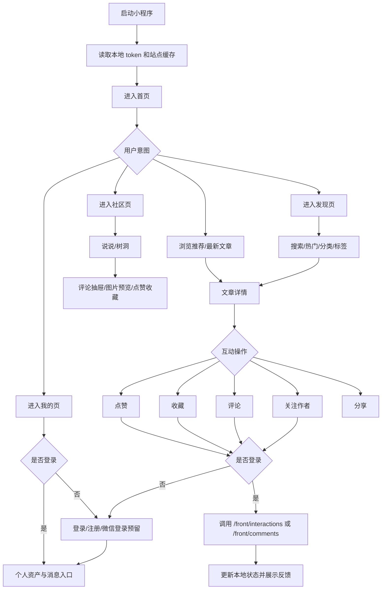

# Sourcelin Blog Uniapp 移动端小程序产品方案

> 版本：v1.1  
> 日期：2026-05-20  
> 适用范围：Sourcelin Blog 移动端小程序 / H5 移动端  
> 参考范围：`sourcelin-ui/sourcelin-ui-platform` 博客前台、`sourcelin-modules/sourcelin-blog` 前台接口、现有 API 契约与项目文档

## 一、项目概述

### 1.1 Web项目核心业务分析

Sourcelin Blog 当前 Web 前台是一个以“内容阅读 + 社区互动 + 个人内容沉淀”为核心的博客前台产品。它不是单纯的文章列表站点，而是围绕个人/小团队内容运营搭建的完整前台：用户可以浏览首页推荐、热门文章、分类、标签、归档，进入文章详情进行阅读、评论、点赞、收藏、关注作者，也可以浏览说说、树洞、友情链接、网站导航、关于页面，并在登录后进入个人中心管理资料、头像、文章、收藏、关注和粉丝。

从前台代码结构看，Web 端业务已经按模块拆分为 `home`、`article`、`hot`、`say`、`treehole`、`navigation`、`notice`、`user`、`auth`、`about` 等领域。每个领域通过 `api`、`pages`、`components`、`composables` 分层组织，说明现有 Web 项目具备较好的业务边界。移动端迁移时应保持领域边界不变，但页面颗粒度、交互方式和信息层级要重新设计，不能简单把 PC 页面缩小。

从后端接口看，博客前台主要通过 `/front/**` 访问博客服务。首页聚合接口为 `/front/home`，文章列表、详情、搜索和浏览上报为 `/front/articles`，分类与标签分别为 `/front/categories`、`/front/tags`，热门模块为 `/front/hot/**`，评论统一为 `/front/comments`，点赞收藏统一为 `/front/interactions`，说说为 `/front/says`，树洞为 `/front/treeholes`，消息中心为 `/front/messages`，用户中心为 `/front/user/**` 与 `/front/users/**`，导航与友链分别为 `/front/navigation`、`/front/links`。这些接口已经遵循统一响应体 `ApiResponse<T>` 和分页 `PageResult<T>`，移动端不需要重新定义业务协议，只需要实现小程序端请求适配、登录态注入、错误提示和缓存策略。

核心业务逻辑可以归纳为四条主链路：

1. 内容发现链路：用户从首页聚合、热门榜、分类、标签、搜索、归档等入口发现文章，再进入详情阅读。
2. 内容互动链路：用户在文章、说说、树洞上进行点赞、收藏、评论、回复、关注作者等行为。
3. 用户资产链路：用户登录后管理个人资料、头像、我的文章、我的收藏、我的关注、我的粉丝和消息通知。
4. 站点运营链路：站点通过公告、导航、友链、关于页面、站点配置和统计数据传达品牌、内容调性与运营信息。

Web 端技术特点是 Vue 3 + TypeScript + Vite + Pinia + Naive UI 抽象层，并采用 Liquid Glass 视觉语言。移动端不能直接复用 Naive UI，也不能完整复用 PC 端复杂的玻璃拟态表现，但可以继承其视觉语义：轻透明卡片、柔和渐变、圆角内容容器、主题色、文章封面图层、阅读沉浸感和状态反馈。

### 1.2 移动端产品定位与目标

Uniapp 移动端定位为 Sourcelin Blog 的“随身阅读与轻互动入口”，优先服务高频阅读、碎片化浏览、轻量评论、收藏回访和个人消息查看，而不是完整替代 PC 前台和管理后台。移动端首版目标是让用户在微信小程序、H5 移动端等场景下快速完成内容消费和基础互动，并逐步扩展到轻发布能力。

本方案的移动端产品原则调整为：不照搬 Web 端全部功能，不把 PC 多页面导航压缩到手机屏幕，而是围绕“优秀小程序项目”的标准重新组织体验。首版只保留用户在移动端高频、低成本、强转化的能力：快速看内容、快速找内容、快速互动、快速回访。Web 端已有但移动场景低频或操作成本高的能力，例如完整文章发布、复杂资料安全设置、长表单友链申请、后台管理类能力，应从首版移除或降级到二级入口。

移动端设计必须体现“简约但有质感”。视觉上延续 Web 前台 Liquid Glass 设计语言，但采用轻量化实现：弱化复杂滤镜和大面积折射，强化半透明卡片、柔和渐变、层叠光感、圆角玻璃容器和细腻动效。体验上坚持内容优先，首页首屏只承载最关键的推荐内容和搜索入口，不堆叠站点宣传、统计面板和过多功能卡片。

产品目标分为三层：

1. 阅读转化目标：用户进入小程序后 3 秒内看到可点击内容，首页首屏展示推荐文章、热门内容和分类入口，降低移动端跳出率。
2. 互动留存目标：文章详情、说说、树洞页面提供移动优先的点赞、收藏、评论、分享能力，评论输入使用底部弹层，减少页面跳转。
3. 用户资产目标：登录用户可以查看收藏、关注、消息、个人资料和自己的文章状态，形成“读完后收藏、评论后收到通知、关注后持续回访”的闭环。

首版不建议把 PC 端发布文章能力作为 P0。原因是长文编辑、富文本/Markdown 编辑、封面上传、分类标签选择在小程序端成本较高，且涉及审核与草稿保存。首版可提供“轻发布说说”和“树洞投递”，完整文章发布放到 P2，通过移动端草稿或简化 Markdown 编辑逐步评估。

### 1.3 目标用户群体与使用场景

移动端主要面向四类用户：

| 用户类型 | 用户特征 | 移动端典型场景 | 产品设计重点 |
|---|---|---|---|
| 内容读者 | 主要消费文章和说说，不一定注册 | 通勤、午休、睡前浏览文章，收藏有价值内容 | 首页推荐、热门榜、阅读体验、无登录浏览、分享 |
| 社区互动用户 | 有登录意愿，愿意评论、点赞、关注 | 读完文章发表评论，收藏文章，关注作者，查看回复 | 登录引导、评论底栏、互动状态同步、消息提醒 |
| 内容创作者 | 博主或小团队成员 | 查看文章反馈，管理个人资料，轻量发布说说 | 数据反馈、我的文章、轻发布、评论管理提示 |
| 站点运营者 | 关心内容分发和留存 | 通过移动端观察热门、公告和用户反馈 | 热门榜、消息通知、数据概览、运营入口预留 |

移动端重点使用场景包括：

1. 微信聊天分享后打开文章：用户从好友或群聊点击分享卡片进入文章详情，页面需要直接展示标题、封面、摘要和正文，不应要求先登录。
2. 搜索内容：用户在小程序首页或发现页输入关键词，先展示热搜和联想词，再进入文章搜索结果。
3. 碎片化刷内容：用户在首页、热门、说说、树洞使用下拉刷新和上拉加载连续消费内容。
4. 读后互动：用户读完文章后通过底部固定操作栏点赞、收藏、评论、分享；未登录时触发半屏登录引导。
5. 个人回访：用户从“我的”进入收藏、关注、消息或自己的文章列表，快速回到历史内容。
6. 匿名表达：树洞允许未登录投递和评论，移动端需要降低表达门槛，但必须展示内容审核、频控和敏感词提示。

### 1.4 核心价值主张

Uniapp 移动端的价值不是复制 Web 页面，而是把 Sourcelin Blog 的内容和互动能力转化为移动场景下更低成本、更高频的使用体验。

核心价值主张如下：

1. 随时阅读：通过小程序入口降低访问成本，用户无需记住域名即可阅读文章、热门和说说。
2. 轻量互动：把点赞、收藏、评论、关注从 PC 的页面区域操作转成移动端底部操作栏、弹层输入和手势反馈。
3. 内容回访：通过收藏、关注、消息、浏览入口和分享卡片让用户形成二次访问。
4. 多端一致：移动端继续遵守统一 API 契约、统一登录域和统一业务状态，不制造第二套数据模型。
5. 渐进扩展：首版聚焦阅读与互动，后续平滑扩展文章轻编辑、订阅消息、分享海报、AI 摘要等移动端增强能力。

## 二、功能架构设计

### 2.1 整体功能模块图（使用Mermaid语法）

```mermaid
graph TD
  A["Sourcelin Blog Uniapp 移动端"] --> B["首页"]
  A --> C["发现"]
  A --> D["阅读详情"]
  A --> E["社区轻互动"]
  A --> F["我的"]
  A --> G["基础能力"]

  B --> B1["搜索入口"]
  B --> B2["主推荐文章"]
  B --> B3["精选内容流"]
  B --> B4["分类快捷入口"]
  B --> B5["轻公告"]

  C --> C1["搜索与联想"]
  C --> C2["热门榜"]
  C --> C3["分类"]
  C --> C4["标签"]
  C --> C5["精选导航"]

  D --> D1["沉浸文章阅读"]
  D --> D2["底部互动栏"]
  D --> D3["评论抽屉"]
  D --> D4["作者卡片"]
  D --> D5["分享卡片"]

  E --> E1["说说 Feed"]
  E --> E2["树洞广场"]
  E --> E3["轻发布"]
  E --> E4["匿名投递"]
  E --> E5["图片预览"]

  F --> F1["登录与用户信息"]
  F --> F2["我的收藏"]
  F --> F3["关注与粉丝"]
  F --> F4["消息入口"]
  F --> F5["资料设置"]

  G --> G1["请求封装"]
  G --> G2["Token 存储"]
  G --> G3["分页缓存"]
  G --> G4["图片预览"]
  G --> G5["跨端兼容"]
```



### 2.2 核心功能迁移清单（保留/优化/新增/移除）

| 处理策略 | 功能 | 移动端设计结论 | 对应接口或能力 |
|---|---|---|---|
| 核心保留 | 首页精选、文章列表、文章详情、搜索、热门、分类、标签 | 作为小程序主体验，围绕“打开即看、搜索即达、读完可互动”设计 | `/front/home`、`/front/articles`、`/front/hot/**`、`/front/categories`、`/front/tags` |
| 核心保留 | 点赞、收藏、评论、回复、关注作者、分享 | 全部移动化为底部操作栏、评论抽屉、半屏登录引导和分享卡片 | `/front/interactions/**`、`/front/comments`、`/front/follows` |
| 移动优化 | 说说、树洞 | 作为“社区轻互动”板块，不做复杂信息流；说说强调图片和短内容，树洞强调匿名表达 | `/front/says`、`/front/treeholes` |
| 移动优化 | 我的收藏、关注/粉丝、消息、资料设置 | 聚合到“我的”页二级入口，不单独占用底部 Tab | `/front/interactions/collects`、`/front/users/**`、`/front/messages`、`/front/user/**` |
| 精简保留 | 友链、网站导航、关于本站 | 不进入一级导航，放到“发现”或“我的-更多”中，作为站点补充能力 | `/front/links`、`/front/navigation`、`/front/config/about` |
| 新增体验 | 搜索历史、阅读进度、分享卡片、图片预览、列表缓存 | 不新增后端复杂能力，主要通过前端缓存和小程序原生能力增强体验 | 本地缓存、`onShareAppMessage`、`uni.previewImage` |
| 首版移除 | 完整文章发布、复杂文章编辑、修改密码、忘记密码、后台管理 | 不符合简约小程序首版定位，后续通过 H5 跳转或 P2 再评估 | Web 端继续承载 |

### 2.3 功能优先级划分（P0/P1/P2）

| 优先级 | 功能范围 | 交付目标 | 验收要点 |
|---|---|---|---|
| P0 | 首页、发现、文章列表、文章详情、搜索、登录、点赞、收藏、评论、分享、我的收藏、我的关注只读列表、说说基础浏览与互动 | 形成“看内容 -> 找内容 -> 读详情 -> 轻互动 -> 关注/收藏回访”的最小优秀小程序闭环 | 首屏简洁；未登录可阅读和分享；登录后可评论、点赞、收藏、关注并查看关注列表；分页字段只使用 `items/total/page/pageSize/totalPages` |
| P1 | 树洞、粉丝列表、消息入口、头像上传、用户主页、友链/导航轻入口、跨会话阅读进度、举报入口、订阅消息、无障碍增强 | 形成社区轻互动和用户资产闭环 | 社区页不复杂；消息不占一级 Tab；树洞匿名投递有审核提示；举报不打断阅读；用户资产入口清晰 |
| P2 | 发布文章、编辑文章、修改密码、分享海报、离线阅读、AI 摘要、深色主题、H5 SEO 适配、个性化推荐 | 提升创作、传播和长期体验 | 长文本编辑稳定；分享海报包含文章标题/封面/二维码；跨端差异有降级方案；推荐能力基于埋点数据逐步上线 |

P0 的范围必须严格控制，不建议把“完整文章发布”和“管理后台能力”提前纳入首版。移动端首版的成功标准是阅读、搜索、详情、互动、收藏和个人回访可用，而不是功能数量最多。

## 三、页面设计与交互规范

### 3.1 整体UI风格定位

移动端视觉延续 Web 前台的 Liquid Glass 气质，但需要做“轻量化玻璃”处理。PC 端可以使用较复杂的背景层、玻璃折射和大面积卡片；小程序端需要兼顾性能、滚动流畅度和原生组件限制，因此建议采用“柔和渐变背景 + 半透明白色卡片 + 圆角内容容器 + 清晰文本层级”的设计策略。

小程序 UI 的目标不是炫技，而是“第一眼有质感，连续使用不累”。液态玻璃语言在移动端应服务内容层级：重点卡片有更强的透明层和高光，普通列表保持干净克制，表单和操作区保持高对比可读。避免每个卡片都使用重阴影、强模糊和复杂纹理，否则会造成视觉噪声和滚动性能风险。

整体 UI 风格定义如下：

| 设计项 | 移动端规范 | 实现说明 |
|---|---|---|
| 主色 | 靛蓝/蓝紫延续品牌，但降低饱和度 | 通过 SCSS 变量或 UnoCSS/Tailwind token 定义 `--sl-primary`、`--sl-primary-soft` |
| 背景 | 首页和详情使用渐变氛围背景，列表页使用浅灰底 | 小程序端避免大面积 `backdrop-filter`，用透明 PNG/渐变替代 |
| 卡片 | 圆角 24rpx，轻阴影，边框 1rpx | 文章卡、说说卡、树洞卡、用户卡统一组件化 |
| 字体层级 | 标题 36rpx/32rpx，正文 30rpx，辅助 24-26rpx | 正文阅读区行高建议 1.75，保证长文舒适度 |
| 导航 | 底部 TabBar + 页面内分段筛选 | P0 TabBar 建议：首页、发现、社区、我的；消息降级为“我的”页入口 |
| 操作反馈 | Toast、Loading、Skeleton、空态插画 | 请求失败提供重试按钮，不用只显示错误文字 |
| 安全区 | 适配 iPhone 底部安全区和微信胶囊 | 底部操作栏使用 `safe-area-inset-bottom` |
| 可访问性 | 点击热区不小于 80rpx，正文跟随系统字体缩放 | P0 保证按钮热区；P1 支持高对比度模式和微信辅助能力适配 |

移动端页面不要直接复刻 PC 顶部导航。PC 顶部导航包含首页、热门、文章、说说、树洞、关于等入口，移动端应改为四个底部 Tab：首页、发现、社区、我的。热门、分类、标签、导航、友链和关于全部通过发现页或我的页二级入口承载。这样能避免入口过多导致认知负担，也更符合优秀小程序“少入口、高转化、强路径”的设计标准。

#### 3.1.1 Liquid Glass Mobile 设计语言

Sourcelin Blog 移动端采用 **Liquid Glass Mobile Spec v1.0**。该规范将 PC 端“Liquid Glass（液态玻璃）”转译为适合 Uniapp/微信小程序的轻量化、高性能、杂志感界面表现，核心原则为“内容展览化、结构非对称、光影轻量化”。

核心冲突与解法：小程序端不适合大面积使用 `backdrop-filter: blur`。移动端通过“伪透光色块（Layered Light）”和“微渐变极细边框（1rpx Gradient Border）”模拟玻璃折射，在保障 60fps 滚动性能的同时保留液态玻璃的先锋艺术调性。

设计理念：

1. 内容展览化：页面不做传统博客列表平铺，而是像数字美术馆一样组织内容。首页、发现页和文章列表通过大面积留白、强字重标题、错落卡片节奏，引导用户沉浸式浏览。
2. 非对称杂志感：避免死板轴对称和统一“左图右文”。卡片可使用视觉重心交错、图片局部出格、文字层叠和不等高双列，形成纸媒杂志式排版。
3. 光影轻量化：移动端不堆叠高耗能模糊层，优先使用径向渐变光球、半透明容器、1rpx 高光边框和低透明阴影。

#### 3.1.2 全局设计令牌

色彩令牌：

| Token 名称 | 变量名 | 颜色值 | 适用场景 |
|---|---|---|---|
| 品牌主色：夜空靛 | `--sl-color-primary` | `#3B59FF` | 核心高光、焦点按钮、主要状态 |
| 柔和主题色：极光紫 | `--sl-color-primary-soft` | `#8F70FF` | 渐变辅助色、次级高光标签 |
| 弥散光底色 A | `--sl-glow-a` | `rgba(59, 89, 255, 0.08)` | 页面顶部弥散氛围光球 |
| 弥散光底色 B | `--sl-glow-b` | `rgba(143, 112, 255, 0.06)` | 页面中段背景柔和过渡光球 |
| 暗色模式主色 | `--sl-dark-primary` | `#5A75FF` | 深色主题下的高亮文本与图标 |
| 全透超白卡片 | `--sl-bg-glass-pure` | `rgba(255, 255, 255, 0.65)` | 一级核心内容容器 |
| 轻透有色卡片 | `--sl-bg-glass-tint` | `rgba(255, 255, 255, 0.40)` | 二级辅助内容、错落层叠卡片 |
| 标准字色：黑曜石 | `--sl-text-main` | `#111827` | 正文、核心大标题 |
| 次级字色：烟灰 | `--sl-text-sub` | `#4B5563` | 摘要、时间、副标题、元数据 |

几何与边框令牌：

```css
--sl-radius-main: 24rpx;
--sl-radius-card: 32rpx;
--sl-radius-pill: 100rpx;
--sl-border-glass: 1rpx solid rgba(255, 255, 255, 0.7);
--sl-border-glass-sub: 1rpx solid rgba(255, 255, 255, 0.3);
--sl-shadow-glass: 0 8rpx 32rpx -4rpx rgba(31, 38, 135, 0.04);
--sl-shadow-active: 0 16rpx 48rpx -2rpx rgba(59, 89, 255, 0.12);
```

排版规则：

1. 标题使用 `font-weight: 700` 或 `600`，正文使用 `font-weight: 400`。
2. 长文正文行高固定为 `line-height: 1.75`，字间距为 `letter-spacing: 0.02em`。
3. 首页主标题和专题标题允许使用更高字重比，形成杂志封面效果；普通元信息必须收敛为次级字色。

#### 3.1.3 非对称杂志感布局规则

首页精选内容流、文章列表和社区 Feed 应交替使用三种卡片模板，可通过 `index % 3` 动态渲染。

| 模板 | 名称 | 形态 | 适用页面 |
|---|---|---|---|
| A | 视觉出格流（Out-of-Bounds Card） | 大封面图占据卡片左侧或上部，图片通过负 `margin` 或绝对定位局部延伸出卡片边界，文字层叠在右下角浅色玻璃面板上 | 首页主推荐、推荐文章、热门榜首位 |
| B | 重心交错流（Interlocking Grid） | 双列瀑布流中左列与右列卡片高度保持约 `1.35 : 1` 的非等高节奏，形成斜向阅读动线 | 社区页、发现页推荐站点、说说图片流 |
| C | 纯白留白流（Zen Space Card） | 无封面纯文字卡片，`padding: 40rpx`，标题字号 `34rpx`，右下角放置弱化阅读/点赞图标 | 文章列表穿插项、无图文章、阅读缓冲卡 |

实现要求：

1. 列表不能连续出现 3 张同构卡片；每 3-5 条内容必须插入一次模板 C，降低视觉疲劳。
2. 图片出格不能影响点击热区，卡片容器仍保持完整可点击区域。
3. 双列瀑布流只用于短内容和图片内容；长文列表优先单列，避免阅读摘要断裂。

#### 3.1.4 高性能轻量化玻璃态实现

生成 Uniapp 样式时必须优先使用伪玻璃面板，不允许在小程序端大面积启用真实背景模糊。

```scss
@mixin sl-glass-panel($opacity: 0.65, $blur: 16rpx) {
  position: relative;
  background: rgba(255, 255, 255, $opacity);
  border-radius: var(--sl-radius-main);
  box-shadow: var(--sl-shadow-glass);

  /* #ifdef H5 || APP-PLUS */
  backdrop-filter: blur($blur);
  -webkit-backdrop-filter: blur($blur);
  /* #endif */

  &::after {
    content: '';
    position: absolute;
    inset: 0;
    border-radius: inherit;
    padding: 1rpx;
    background: linear-gradient(
      135deg,
      rgba(255, 255, 255, 0.8) 0%,
      rgba(255, 255, 255, 0.1) 40%,
      rgba(59, 89, 255, 0.1) 100%
    );
    -webkit-mask: linear-gradient(#fff 0 0) content-box, linear-gradient(#fff 0 0);
    -webkit-mask-composite: xor;
    mask-composite: exclude;
    pointer-events: none;
  }
}
```

页面弥散光球统一收口到 `PageShell`，禁止每个业务组件自行创建多个光球节点。

```scss
.page-shell-container {
  position: relative;
  background-color: #F8FAFC;
  overflow: hidden;

  &::before,
  &::after {
    content: '';
    position: fixed;
    width: 600rpx;
    height: 600rpx;
    border-radius: 50%;
    pointer-events: none;
    z-index: 0;
  }

  &::before {
    top: -200rpx;
    left: -150rpx;
    background: radial-gradient(circle, var(--sl-glow-a) 0%, rgba(255, 255, 255, 0) 70%);
  }

  &::after {
    top: 400rpx;
    right: -200rpx;
    background: radial-gradient(circle, var(--sl-glow-b) 0%, rgba(255, 255, 255, 0) 70%);
  }
}
```

#### 3.1.5 空间微交互规范

所有可点击玻璃卡片和图标按钮的 `active` 状态禁止简单变暗，必须使用缩放和高光扩散表达触觉阻尼。

```css
.sl-clickable-card:active {
  transform: scale(0.97);
  transition: transform 0.2s cubic-bezier(0.25, 1, 0.5, 1);
  box-shadow: var(--sl-shadow-active);
}
```

评论抽屉和目录抽屉弹出时，主视图应配合产生空间退让效果。小程序端如果 `filter` 性能不稳定，可只保留 `transform` 与圆角。

```css
.page-body-under-drawer {
  transform: scale(0.96);
  border-radius: var(--sl-radius-card);
  filter: brightness(0.85);
  transition: all 0.35s cubic-bezier(0.32, 0.94, 0.6, 1);
}
```

下拉刷新或页面骨架屏等待时，`PageShell` 背景光球可使用低频呼吸动画；动画必须只作用于根部伪元素，不作用于长列表卡片。

```css
@keyframes prelude-orb-pulse {
  0% { transform: translate(0, 0) scale(1); opacity: 0.8; }
  50% { transform: translate(40rpx, 30rpx) scale(1.15); opacity: 0.5; }
  100% { transform: translate(0, 0) scale(1); opacity: 0.8; }
}
```

### 3.2 核心页面流程图（使用Mermaid语法）



### 3.3 关键页面详细设计（每个页面包含：页面功能、元素布局、交互逻辑）

#### 3.3.1 首页

页面功能：承载移动端首屏内容分发，重点展示搜索入口、主推荐内容、精选内容流和少量分类入口。首页对应 Web 的 `HomePage` 和 `/front/home` 聚合数据，但移动端要减少首屏信息密度，不展示复杂站点统计、过多公告和大面积介绍内容。

元素布局：

1. 顶部区域：状态栏下方展示站点 Logo、站点名称和搜索胶囊，不在首页顶部堆叠多个功能按钮；消息角标放到“我的”页。
2. 轻公告：最多展示一条可横向滚动公告，内容来自首页 `siteInfo.notice` 或 `/front/messages` 系统公告；无公告时不占位。
3. 主推荐卡：展示 1 条置顶或推荐文章的大封面玻璃卡片，包含标题、摘要、分类、阅读量。
4. 分类快捷入口：横向滚动 5-6 个高频分类，超过部分进入发现页查看。
5. 精选内容流：推荐文章和最新文章合并为一个内容流，使用 Liquid Glass Mobile 的 A/B/C 卡片模板按 `index % 3` 交替渲染，避免首页出现多个重复列表标题。

交互逻辑：

1. 页面 `onLoad` 读取本地缓存中的首页数据，立即渲染骨架或旧数据，再请求 `/front/home?page=1&pageSize=10` 刷新。
2. 下拉刷新时重新请求首页聚合和未读数，刷新完成后调用 `uni.stopPullDownRefresh()`。
3. 点击文章卡片跳转 `/pages/article/detail?id=xxx`，详情页加载成功后上报浏览量。
4. 点击分类入口跳转文章列表，并携带 `categoryId`。
5. 首页列表上拉加载使用 `/front/articles`，不要重复请求整个 `/front/home`。

#### 3.3.2 发现页

页面功能：聚合搜索、热门和核心分类，是移动端内容发现的主入口。发现页不承担 Web 端所有二级页面的平铺展示，标签、归档、导航、友链统一放入“更多发现”二级入口，避免首屏信息密度过高。

元素布局：

1. 顶部搜索框：常驻，展示占位文案“搜索文章、标签、分类”。
2. 热门榜模块：展示热门文章 Top 10，前三名突出排名样式。
3. 核心分类模块：只展示 5 个以内高频分类，剩余分类进入“全部分类”页。
4. 更多发现入口：标签云、归档、网站导航、友链放入二级入口，不在首屏直接展开。
5. 推荐导航卡：P1 展示少量推荐站点，使用重心交错流模板制造不等高节奏；点击外链时使用复制链接或小程序 `web-view` 白名单策略。

交互逻辑：

1. 进入发现页时并行请求 `/front/hot/articles`、`/front/categories`；标签、归档、导航在用户进入“更多发现”后再懒加载。
2. 热门分类切换使用横向 Tab，请求 `/front/hot/articles?page=1&pageSize=20&categoryId=xxx`。
3. 搜索页保存最近 10 条历史关键词到本地缓存，用户可清空。
4. 搜索建议使用 300ms 防抖请求 `/front/search/suggestions?keyword=xxx`。
5. 文章搜索结果使用 `/front/articles/search`，分页字段统一读取 `items`。

#### 3.3.3 文章列表页

页面功能：承载分类文章、标签文章、搜索结果、归档和普通文章列表。移动端应统一为一个列表容器页面，通过不同参数切换标题和筛选条件。

元素布局：

1. 顶部导航栏：返回按钮 + 动态标题，如“全部文章”“分类：后端”“标签：Vue”。
2. 筛选条：分类、排序、只看推荐等筛选入口，移动端使用底部抽屉。
3. 文章卡片：封面、标题、摘要、分类、标签、发布时间、阅读量、评论数；列表按内容质量和封面情况选择视觉出格流、重心交错流、纯白留白流，不能全部采用同一种卡片。
4. 加载状态：首屏骨架、空态、错误态和底部加载更多。

交互逻辑：

1. 页面参数包含 `categoryId`、`tagId`、`keyword`、`orderBy` 等，优先根据参数选择接口：分类用 `/front/categories/articles/{id}`，标签用 `/front/tags/articles/{id}`，搜索用 `/front/articles/search`，普通列表用 `/front/articles`。
2. 筛选变化后重置 `page=1` 和列表数据。
3. 上拉加载时如果 `currentPage >= totalPages`，展示“没有更多了”。
4. 点击卡片进入文章详情，并把来源参数写入页面栈，用于详情页返回时恢复列表滚动位置。

#### 3.3.4 文章详情页

页面功能：提供沉浸式长文阅读、作者信息、目录、评论、点赞、收藏、关注和分享。它是移动端最核心页面，需要比 Web 端更重视阅读连续性。

元素布局：

1. 顶部封面：文章封面、分类、原创/转载标识、标题、摘要、作者头像、发布时间、阅读时长。
2. 正文区域：使用 `rich-text` 或适配后的 Markdown/HTML 渲染组件，代码块支持横向滚动。
3. 浮动目录：右侧或底部按钮打开目录抽屉，目录来自正文标题解析；小程序解析能力不足时可由前端在 HTML 转换阶段生成锚点。
4. 作者卡：头像、昵称、简介、文章数、粉丝数、关注按钮。
5. 评论区：默认展示前 3 条评论，点击“查看全部”打开评论抽屉。
6. 底部操作栏：评论输入入口、点赞、收藏、分享、回到顶部。

交互逻辑：

1. `onLoad` 调用 `/front/articles/{id}` 获取详情；成功后调用 `/front/articles/view/{id}`，失败不提示阻断。
2. 如果 `readFull=false` 且 `needLogin=true`，正文展示前 300 字摘要和“登录后查看完整内容，还可收藏回访”轻引导，底部操作栏保留分享和登录按钮，避免强制弹窗打断阅读。
3. 点赞、收藏使用乐观更新：先更新按钮状态和计数，再调用 `/front/interactions/likes/article/{id}` 或 `/front/interactions/collects/article/{id}`；失败回滚。
4. 评论输入使用底部弹层，未登录时弹出登录引导；登录成功后自动续做用户之前触发的点赞、收藏、评论或关注操作，不要求用户重新点击。
5. 分享使用小程序 `onShareAppMessage`，标题为文章标题，路径为 `/pages/article/detail?id=xxx`，封面优先使用文章封面；首次从分享卡片进入时展示轻引导层，提示收藏文章或关注作者，用户关闭后本地记忆。
6. P1 支持跨会话阅读进度：本地缓存 `articleId`、滚动位置、阅读时长和更新时间；再次打开同一文章时提示“继续上次阅读”，由用户确认后定位，避免自动跳转造成困惑。
7. 从分类、搜索、热门、关注作者等列表进入文章时，返回需恢复对应来源列表的滚动位置和筛选状态，不统一回到首页。

#### 3.3.5 社区页：说说与树洞

页面功能：承载轻内容消费与表达。P0 先提供说说列表、基础点赞和评论，补足社区轻互动氛围；P1 扩展树洞广场、匿名投递和说说发布。顶部使用分段控件在“说说”和“树洞”之间切换，但未上线树洞发布前不暴露不可用入口。

元素布局：

1. 顶部分段控件：说说 / 树洞。
2. 说说 Feed：作者头像、昵称、发布时间、正文、图片九宫格、点赞/收藏/评论按钮；多图内容优先使用重心交错流，不做普通等高九宫格平铺。
3. 树洞 Feed：匿名或昵称头像、内容卡、点赞/收藏/评论、顶部轻弹幕或精选一句；无图内容优先使用纯白留白流，突出文字情绪。
4. 发布入口：P1 开启右下角悬浮按钮，登录用户可发说说，树洞允许匿名投递。

交互逻辑：

1. 说说列表请求 `/front/says?page&pageSize`，树洞请求 `/front/treeholes?page&pageSize`。
2. 图片点击使用 `uni.previewImage`，避免自定义大图查看器造成兼容问题。
3. 说说发布 P1 支持文字 + 多图；图片上传前压缩，单张建议不超过 2MB。
4. 树洞投递不强制登录，但必须提示“内容会经过审核，请勿提交敏感信息”。投递失败或网络中断时，本地草稿暂存 1 小时；提交成功后进入结果提示页，展示“已提交审核/已发布”状态，不引入手机号或验证码通知链路。
5. 评论复用统一评论抽屉，`source` 分别传 `say` 和 `treehole`。
6. P1 在文章、说说、树洞详情或卡片更多菜单中增加轻量举报入口；若后端举报接口未完成，则入口不展示，不做无效表单。

#### 3.3.6 消息页

页面功能：展示系统公告和后续互动通知。首版后端当前基础版主要支持系统公告频道，移动端 UI 需要为评论回复、点赞收藏、关注通知预留频道。

元素布局：

1. 顶部频道 Tab：系统公告、评论回复、点赞收藏、关注、私信预留。
2. 消息列表：标题、摘要、时间、未读点。
3. 批量操作：全部已读。
4. 空态：未登录时提示登录查看消息，已登录无消息时展示空态。

交互逻辑：

1. 系统公告请求 `/front/messages?channel=system&page=1&pageSize=20`。
2. 点击消息进入详情并调用 `/front/messages/{id}/read`。
3. 全部已读调用 `/front/messages/read-all` 后刷新未读数。
4. 未读角标通过 `/front/messages/unread-count` 更新，同时写入全局 store。

#### 3.3.7 我的页

页面功能：承载登录入口、个人资料、我的文章、收藏、关注、粉丝、消息、设置等用户资产。

元素布局：

1. 未登录态：头像占位、登录按钮、产品权益说明。
2. 已登录态：头像、昵称、简介、文章数、收藏数、关注数、粉丝数。
3. 功能宫格：我的文章、我的收藏、我的关注、我的粉丝、消息通知、资料设置。
4. 内容列表：点击功能入口进入对应子页面，而不是在一个页面内用复杂 Tab 承载所有内容。

交互逻辑：

1. 进入页面读取 token；无 token 展示未登录态。
2. 已登录调用 `/front/user/info`、`/front/user/stats` 获取信息和统计。
3. 头像上传使用 `uni.chooseImage` + `uni.uploadFile`，成功后刷新用户信息。
4. 我的收藏支持按 `article/say/treehole` 筛选，接口为 `/front/interactions/collects`。
5. 我的关注只读列表纳入 P0，用于承接“关注作者 -> 回访作者内容”的闭环；粉丝列表、互关状态和主动关系管理放到 P1。
6. 我的文章列表展示状态，编辑文章不作为 P0，首版点击已发布文章进入详情，草稿/审核中文章只展示状态。

### 3.4 移动端特有交互设计（下拉刷新、上拉加载、侧滑、手势等）

| 交互 | 应用页面 | 具体实现 |
|---|---|---|
| 下拉刷新 | 首页、发现、文章列表、说说、树洞、消息、我的收藏 | 在 `pages.json` 开启 `enablePullDownRefresh`，刷新时重置分页并重新请求第一页；同一页面下拉刷新增加 10 秒节流，避免重复请求 |
| 上拉加载 | 所有列表页 | 使用 `onReachBottom`，当 `page < totalPages` 时加载下一页；加载中禁止重复请求 |
| 底部评论抽屉 | 文章详情、说说、树洞 | 使用 `uni-popup` 或自研 BottomSheet，输入框聚焦时适配键盘高度；P1 增加常用表情快捷输入 |
| 图片预览 | 文章封面、说说图片、树洞头像、友链头像 | 使用 `uni.previewImage`，传入当前图片和图片数组 |
| 左滑操作 | 我的收藏、我的关注、我的文章 | P1 支持左滑取消收藏/取消关注/删除草稿，操作前二次确认 |
| 长按复制 | 文章链接、友链信息、树洞内容 | 使用 `uni.setClipboardData`，敏感内容不自动复制 |
| 回到顶部 | 长文章详情、长列表页 | 滚动超过 800rpx 展示悬浮按钮，调用 `uni.pageScrollTo`，滚动时长控制在 300ms 左右 |
| 分享 | 文章详情、说说详情、首页 | 实现 `onShareAppMessage`，生成包含 id 的小程序路径 |
| 登录半屏引导 | 所有需要登录的操作 | 未登录点击点赞/收藏/评论/关注时弹出半屏，不直接跳走破坏上下文；登录成功后自动续做之前的操作 |
| 骨架屏 | 首页首屏、文章详情、列表页 | 使用统一 Skeleton 组件，避免空白等待；下拉刷新和加载更多要有明确可视反馈 |
| 页面栈控制 | 文章详情、说说、树洞 | 文章详情作为独立页面；说说/树洞的评论、图片预览、轻详情优先使用弹层，减少返回成本 |

## 四、技术选型与架构建议

### 4.1 Uniapp版本选择与配置

建议使用 Uniapp + Vue 3 + TypeScript 作为移动端主线，创建独立子项目 `sourcelin-ui/sourcelin-ui-uniapp`。构建目标优先级为微信小程序，其次 H5 移动端，后续可扩展 App。

推荐基础配置：

| 配置项 | 建议 |
|---|---|
| 框架 | Uniapp Vue 3 + TypeScript |
| 构建工具 | Vite 版 Uniapp |
| 包管理 | pnpm 或 npm，需与仓库前端约定一致后固定 |
| 目录结构 | `src/pages`、`src/subpackages`、`src/components`、`src/modules`、`src/shared`、`src/stores` |
| 分包策略 | 文章详情、用户资产、关于/导航可分包，首页、发现、社区、我的保留主包 |
| 环境变量 | 开发环境指向网关代理，生产环境指向 HTTPS 网关域名 |
| 小程序配置 | `appid` 不写入公开仓库，使用本地配置或 CI 注入 |

建议目录结构：

```text
sourcelin-ui/sourcelin-ui-uniapp/
  src/
    pages/
      home/home.vue
      discover/discover.vue
      community/community.vue
      mine/mine.vue
    pages-article/
      detail/detail.vue
      list/list.vue
      search/search.vue
    pages-user/
      login/login.vue
      profile/profile.vue
      collects/collects.vue
      follows/follows.vue
    pages-messages/
      index/index.vue
    pages-about/
      index/index.vue
    modules/
      article/api/article.api.ts
      comment/api/comment.api.ts
      interaction/api/interaction.api.ts
      user/api/user.api.ts
    shared/
      api/http.ts
      types/api.ts
      utils/auth.ts
      utils/cache.ts
      components/
    stores/
      user.store.ts
      app.store.ts
```

### 4.2 UI组件库选型

建议使用 `uview-plus` 或 `uni-ui` 作为基础组件库，首选 `uview-plus`，原因是移动端表单、弹层、Tab、Toast、Skeleton、Upload、SwipeAction 等能力更完整，适合快速覆盖 P0/P1 场景。但项目应建立自己的 `S*` 移动 UI 抽象层，不让业务页面直接散落组件库细节。

组件层建议：

1. 基础 UI 抽象：`SButton`、`SCard`、`SInput`、`SAvatar`、`STag`、`SBottomSheet`、`SSkeleton`、`SEmpty`。
2. 业务组件：`ArticleCard`、`ArticleActionBar`、`CommentSheet`、`SayCard`、`TreeholeCard`、`UserStatGrid`。
3. 页面容器：`PageShell`、`ListPageShell`、`AuthGuardPanel`。

移动端 UI 抽象层必须承载 Liquid Glass Mobile 规范：

| 组件 | 设计职责 | 关键约束 |
|---|---|---|
| `PageShell` | 页面弥散光球、背景底色、安全区、页面级加载态 | 统一生成 `::before/::after` 光球，业务组件禁止重复创建背景光球 |
| `SCard` | 玻璃面板、1rpx 渐变边框、点击阻尼 | 内置 `sl-glass-panel`，支持 `variant: pure/tint/zen/outbound` |
| `ArticleCard` | 首页和列表内容卡片 | 支持 A/B/C 三种杂志模板，由 `index % 3` 或显式 `layout` 控制 |
| `SBottomSheet` | 评论、目录、筛选抽屉 | 弹出时向页面根节点同步 `page-body-under-drawer` 状态 |
| `SSkeleton` | 首屏和刷新等待 | 可触发 `prelude-orb-pulse`，但不能在每个骨架项上做复杂动画 |

样式边界：

1. 业务页面不得直接写大面积 `backdrop-filter`，真实模糊只允许在 H5/App 条件编译中启用。
2. 业务组件不得自行定义第二套玻璃颜色、圆角和阴影，必须消费 `--sl-*` token。
3. 长列表卡片禁止叠加多层 `filter/blur/box-shadow`，优先用渐变边框和低透明阴影表达层次。

小程序端需要避免大面积复杂 CSS 滤镜和不稳定的 Web API。Web 前台中依赖 DOM 的文章目录解析、剪贴板、浏览器窗口操作、`window.open` 等能力，在 Uniapp 中必须改为条件编译或小程序 API。例如外链导航不能直接 `window.open`，应提供“复制链接”或 H5 端使用 `location.href`，微信小程序端仅对业务允许域名使用 `web-view`。

### 4.3 网络请求与数据缓存方案

移动端请求层必须复刻 Web 端 API 契约：服务端返回 `ApiResponse<T>`，成功码为 `0`，请求层解包后页面只消费业务数据；分页统一使用 `PageResult<T>` 的 `items/total/page/pageSize/totalPages`。

请求封装建议：

1. 使用 `uni.request` 封装 `requestData<T>()`，参数包括 `url`、`method`、`data`、`params`、`headers`、`skipErrorToast`、`skipAuthRedirect`。
2. 请求前从本地存储读取 token、tokenName、tokenPrefix，拼接请求头。默认注入 token，匿名接口显式传 `isToken: false`。
3. 响应后检查 `code` 是否为 `0`。非 0 时按错误码处理，401 弹出登录引导或跳登录页；如果后端后续提供刷新 token 接口，再接入静默刷新，当前不把静默刷新作为 P0 阻塞项。
4. 分页请求统一封装 `createPagingQuery()`，避免每个页面重复维护 `page/pageSize/loading/finished`。
5. 上传文件使用 `uni.uploadFile` 单独封装，响应仍需按 `ApiResponse<T>` 解析。
6. 弱网场景下，GET 分页请求允许用户手动重试或短延迟自动重试一次；点赞、收藏、评论等写操作不进入自动重放队列，避免重复提交，只保留用户可见的失败反馈和草稿保护。

缓存策略：

| 数据 | 缓存位置 | 有效期 | 刷新策略 |
|---|---|---|---|
| Token 与登录信息 | `uni.setStorageSync` | 后端 token 有效期 | 登录/登出时更新 |
| 首页聚合数据 | 本地缓存 | 10 分钟 | 首页启动先读缓存，后台刷新 |
| 分类/标签 | 本地缓存 | 1 小时 | 发现页进入时后台刷新 |
| 搜索历史 | 本地缓存 | 长期 | 最多 10 条，用户可清空 |
| 未读数 | 全局 store + 本地缓存 | 1 分钟 | 启动、进入消息页、标记已读后刷新 |
| 列表分页 | 内存 store | 当前会话 | 返回列表页时恢复滚动和数据 |
| 阅读进度 | 本地缓存 | 30 天 | P1 缓存文章 ID、滚动位置、阅读时长和更新时间，重新进入时提示恢复 |
| 树洞/评论草稿 | 本地缓存 | 1 小时 | 网络失败或退出弹层时暂存，提交成功后清理 |

图片策略：

1. 文章列表、首页推荐、说说九宫格优先加载缩略图，进入详情或图片预览时再加载原图。
2. 所有远程图片统一经过 `resolveImageUrl()` 处理，支持默认图、错误图和 HTTPS 校验。
3. 列表图片开启懒加载，首屏图片数量控制在 4-6 张以内。
4. 小程序端避免在长列表卡片中使用复杂滤镜和大面积阴影；如果真机性能不达标，再评估接入虚拟列表，不将虚拟列表作为 P0 强依赖。

### 4.4 状态管理方案

建议使用 Pinia（Uniapp Vue 3 支持）或轻量 store。由于现有 Web 前台使用 Pinia，移动端继续使用 Pinia 有助于保持认知一致。

核心 Store 设计：

| Store | 职责 | 关键字段 |
|---|---|---|
| `user.store.ts` | 登录态、当前用户、权限、登出 | `token`、`tokenName`、`tokenPrefix`、`userInfo`、`isLoggedIn` |
| `app.store.ts` | 站点信息、启动状态、主题、未读数 | `siteInfo`、`homeReady`、`unreadCount`、`theme` |
| `feed.store.ts` | 首页/发现列表缓存和滚动位置 | `homeSnapshot`、`discoverSnapshot`、`scrollTopMap` |
| `draft.store.ts` | 说说、树洞、评论草稿 | `sayDraft`、`treeholeDraft`、`commentDraftMap` |

状态边界必须清晰：全局 Store 只放跨页面共享状态，页面列表分页和筛选状态优先放页面 composable；评论输入、弹层开关、临时加载状态不要放全局，避免用户从一个详情页切到另一个详情页时状态串扰。

### 4.5 跨平台兼容性处理

移动端首版以微信小程序为主，H5 作为次级目标。跨平台差异需要在设计阶段明确：

| 能力 | 微信小程序 | H5 移动端 | 处理方案 |
|---|---|---|---|
| 登录 | 支持账号密码，预留微信登录 | 支持账号密码/邮箱登录 | 微信登录作为 P1/P2，需要后端新增小程序 code 换 token 接口 |
| 分享 | `onShareAppMessage` | Web Share API 或复制链接 | 统一封装 `shareArticle()`，按平台分支 |
| 外链 | 受业务域名白名单限制 | 可直接打开 | 小程序优先复制链接，H5 可跳转 |
| 富文本 | `rich-text` 标签能力有限 | 可使用 HTML 渲染 | 文章内容需做白名单清洗和样式转换 |
| 文件上传 | `uni.uploadFile` | `FormData` | 统一上传适配器 |
| 剪贴板 | `uni.setClipboardData` | Clipboard API | 统一封装 |
| 订阅消息 | 可用 | 不可用 | 仅小程序端展示订阅入口 |
| 安全区 | 需要适配胶囊和底部 | 需要适配浏览器底栏 | 使用安全区变量和平台条件编译 |

后端接口层面，小程序微信登录不是当前 Web 登录的简单复用。现有认证接口以账号密码、验证码、邮箱验证码为主，并使用 Sa-Token。若要支持微信一键登录，需要新增 `/auth/wechat/mini/login` 或类似接口，用 `code` 换取 `openId/sessionKey`，再绑定或创建博客用户，最终仍返回 `token/tokenName/tokenPrefix/expiresIn/loginType`，保持前端登录态模型一致。微信登录应支持绑定已有账号：用户选择微信登录后，如果手机号/邮箱或 openId 未绑定，先创建临时账号并引导完善资料；如果用户已有账号，提供账号密码或邮箱验证码绑定入口，避免同一用户重复注册多个身份。

H5 移动端不作为首版主战场，但文章详情页仍应保留基础 SEO 能力：正确设置标题、描述、封面 Open Graph 信息和 history 路由兜底。静态化、预渲染和搜索引擎专项优化放到 P2，不影响小程序首版。

## 五、开发计划与里程碑

### 5.1 整体开发周期规划

建议整体开发周期为 8 周，按“基础框架 -> 阅读闭环 -> 互动闭环 -> 用户资产 -> 社区扩展 -> 联调验收”推进。

| 周期 | 阶段 | 目标 |
|---|---|---|
| 第 1 周 | 产品与技术准备 | 确认页面范围、接口矩阵、UI 基础规范、Uniapp 项目脚手架 |
| 第 2 周 | 基础框架 | 完成路由、TabBar、请求封装、Token 存储、基础组件和首页骨架 |
| 第 3 周 | 内容阅读 | 完成首页、文章列表、文章详情、分类、标签、热门 |
| 第 4 周 | 搜索与互动 | 完成搜索、点赞、收藏、评论、关注作者、分享 |
| 第 5 周 | 用户资产 | 完成登录注册、我的页、个人资料、我的收藏、我的关注、我的文章、消息入口 |
| 第 6 周 | 社区扩展 | 完成说说基础互动、树洞、举报入口、友链、导航、关于 |
| 第 7 周 | 兼容与性能 | 微信小程序真机适配、H5 适配、图片优化、缓存和错误态补齐 |
| 第 8 周 | 联调验收 | 全链路测试、缺陷修复、发布配置、上线检查 |

### 5.2 分阶段里程碑与交付物

#### M1：移动端基础工程完成

交付物：

1. `sourcelin-ui/sourcelin-ui-uniapp` 项目目录。
2. `pages.json`、`manifest.json`、环境变量配置。
3. `requestData<T>`、`uploadFile<T>`、统一错误处理、Token 注入。
4. `ApiResponse<T>`、`PageResult<T>`、业务通用类型。
5. TabBar 页面：首页、发现、社区、我的；消息作为“我的”页二级入口。

验收标准：

1. 能在微信开发者工具启动。
2. 能请求 `/front/home` 并渲染首页基础数据。
3. 401 能触发登录引导，不出现页面白屏。
4. 主包体积、页面首屏耗时和授权弹窗流程有初步记录，避免后期才发现审核或体积问题。

#### M2：阅读闭环完成

交付物：

1. 首页推荐、最新、分类入口。
2. 发现页热门、分类、标签。
3. 文章列表和文章详情。
4. 搜索页、搜索建议、搜索历史。
5. 文章分享路径。

验收标准：

1. 未登录用户可以完成首页 -> 列表 -> 详情 -> 分享。
2. 需登录文章展示前 300 字摘要和轻登录解锁引导。
3. 文章详情支持长文阅读、代码块横向滚动和图片预览。
4. 分页加载无重复数据和重复请求，返回列表时恢复滚动位置。

#### M3：互动闭环完成

交付物：

1. 点赞、取消点赞。
2. 收藏、取消收藏。
3. 评论列表、评论发布、回复、删除自己的评论。
4. 关注和取消关注作者。
5. 评论审核状态提示。

验收标准：

1. 未登录操作弹出登录引导，登录后回到原上下文。
2. 登录成功后自动续做用户之前触发的点赞、收藏、评论或关注操作。
3. 乐观更新失败能回滚。
4. 评论内容为空、敏感词、频控等错误可被明确提示。

#### M4：用户与社区完成

交付物：

1. 登录、注册、邮箱验证码流程。
2. 我的页、个人资料、头像上传。
3. 我的文章、我的收藏、我的关注只读列表、粉丝列表。
4. 说说列表、基础互动、树洞列表、树洞投递。
5. 系统消息、举报入口、友链、导航、关于页面；举报提交后进入后台内容举报管理闭环。

验收标准：

1. 登录态本地持久化，退出登录后清理用户数据。
2. 我的收藏可按文章/说说/树洞筛选。
3. 我的关注可承接作者回访。
4. 树洞匿名投递符合后端审核和频控规则，失败草稿本地暂存 1 小时。
5. 文章、说说、树洞等内容举报可入库，并能在后台完成查询、状态处理和删除。

### 5.3 测试计划

测试需要覆盖接口契约、页面流程、跨端兼容、性能和异常场景。

| 测试类型 | 测试范围 | 重点用例 |
|---|---|---|
| 接口契约测试 | 所有 `/front/**` 接口消费 | 只消费 `data` 解包后的业务数据；分页只读取 `items/total/page/pageSize/totalPages` |
| 功能测试 | P0/P1 页面 | 首页加载、文章详情、搜索、评论、点赞、收藏、登录、我的收藏 |
| 登录态测试 | 需要登录的操作 | token 过期、未登录点赞、登录后返回原页面、登录后自动续做原操作、登出清理 |
| 兼容测试 | 微信开发者工具、安卓真机、iOS 真机、H5 | 安全区、键盘顶起、图片预览、富文本、TabBar、系统字体缩放 |
| 性能测试 | 首页、列表、详情 | 首屏渲染、长列表滚动、图片懒加载、缩略图加载、分包体积 |
| 异常测试 | 网络失败、接口错误、空数据 | 断网提示、重试按钮、空态、接口 401/403/429 |
| 安全测试 | 输入与上传 | 评论 XSS、树洞敏感词、头像格式大小、外链复制、举报入口、隐私授权 |
| 埋点测试 | P0 核心行为 | 首页停留、文章阅读时长、点赞/收藏/评论转化、分享点击、分享回流来源 |

建议验收指标：

1. 首页冷启动可交互时间控制在 3 秒内。
2. 文章详情首屏内容 2 秒内出现骨架或缓存内容。
3. 列表上拉加载无明显卡顿，单页数据建议 10-20 条。
4. 小程序主包体积控制在 2MB 以内，详情、用户、社区走分包。
5. 所有登录态接口在 token 失效时有明确提示，不出现静默失败。
6. 点击热区不小于 80rpx，评论抽屉在 iOS/Android 真机键盘下不被遮挡。
7. 小程序提审前完成隐私政策、用户协议、头像/手机号等授权说明核对。

## 六、风险评估与应对措施

### 6.1 技术风险

| 风险 | 表现 | 影响 | 应对措施 |
|---|---|---|---|
| 富文本渲染不一致 | Web 文章 HTML 在小程序 `rich-text` 中样式丢失，代码块、表格、图片显示异常 | 影响文章详情核心体验 | 建立移动端内容转换层，清洗 HTML，统一图片宽度，表格横向滚动，代码块使用自定义组件或降级样式 |
| 小程序外链限制 | 网站导航和友链无法直接打开外部站点 | 导航体验下降 | 小程序端默认复制链接，H5 端直接打开；对已配置业务域名可使用 `web-view` |
| 微信登录需要后端改造 | 当前登录以账号密码/邮箱为主，无小程序 code 换 token 接口 | 影响一键登录体验 | P0 使用账号密码/邮箱登录，P1 设计并新增微信小程序登录接口，返回结构保持现有 token 模型 |
| 上传适配差异 | Web 使用 `FormData`，小程序使用 `uni.uploadFile` | 头像、说说图片上传可能失败 | 独立封装上传适配器，统一解析 `ApiResponse<T>`，限制格式和大小 |
| 长列表性能 | 说说、树洞、文章列表图片多，滚动卡顿 | 影响留存 | 图片懒加载、分页加载、骨架屏、避免复杂阴影和滤镜，必要时引入虚拟列表 |
| API 字段语义遗留 | 评论接口仍使用 `articleId` 承载 say/treehole 目标 ID | 增加前端理解成本 | 移动端内部统一命名为 `targetId`，请求适配层转换为后端当前字段；后续推动后端统一 |
| 主包体积超限 | 组件库、图片资源、富文本渲染库集中进入主包 | 无法通过小程序构建或启动变慢 | `uview-plus` 按需引入，图片资源走 CDN 或远程地址，文章详情、用户资产走分包 |
| 富文本库兼容不确定 | Markdown/HTML 渲染库与现有文章内容格式不完全匹配 | 文章详情显示异常 | P0 先用安全 HTML/rich-text 适配；P1 技术验证 `uni-markdown` 等轻量库，不直接锁死选型 |

### 6.2 产品风险

| 风险 | 表现 | 影响 | 应对措施 |
|---|---|---|---|
| 首版范围过大 | 同时做阅读、社区、发布、管理能力 | 延期且质量不可控 | P0 聚焦阅读与互动，发布文章和复杂设置放 P2 |
| Web/PC 体验照搬到移动端 | 信息密度过高、操作入口拥挤 | 用户难以使用 | 重构为四 TabBar + 发现聚合 + 底部操作栏 + 弹层输入 |
| 登录门槛过高 | 评论、收藏、关注全部要求登录，且登录流程长 | 互动转化低 | 未登录可阅读和分享；需要登录时使用半屏引导；树洞保留匿名能力 |
| 树洞匿名内容风险 | 用户提交敏感、攻击性或隐私内容 | 社区安全风险 | 前端提示规则，后端审核和频控，敏感词拒绝时明确提示 |
| 内容不足导致首页空 | 新站数据少时首页显得空洞 | 首次体验差 | 首页提供站点介绍、推荐分类、空态引导；热门无数据时回退最新文章 |
| 分享回流弱 | 用户从分享页阅读后直接离开 | 收藏、关注和回访不足 | 首次分享落地展示轻引导层，引导收藏文章或关注作者，关闭后不再频繁打扰 |
| 可访问性不足 | 字体过小、按钮热区过小、弱视用户难以操作 | 覆盖用户受限，体验不稳定 | P0 保证热区和系统字体缩放，P1 增加高对比度适配 |

### 6.3 进度风险

| 风险 | 表现 | 影响 | 应对措施 |
|---|---|---|---|
| 小程序真机问题集中爆发 | 开发工具正常，真机键盘、安全区、图片异常 | 后期返工 | 第 2 周起每周真机回归，不等全部开发完成再适配 |
| 后端接口缺口晚发现 | 微信登录、上传、消息频道等能力不完整 | 阻塞联调 | 第 1 周输出接口矩阵，标明复用/新增/降级，P0 不依赖新增后端接口 |
| UI 组件库二次封装不足 | 页面直接依赖组件库，后续替换困难 | 技术债累积 | 建立移动端 `S*` 抽象层，业务页面只用项目组件 |
| 多端同时适配拖慢进度 | 微信小程序、H5、App 差异同时处理 | 首版延期 | 首版只承诺微信小程序 + H5 基础可用，App 暂不验收 |
| 文档与实现脱节 | 产品方案没有同步为接口与页面任务 | 开发理解偏差 | 方案通过后拆分为页面任务、接口任务、组件任务和测试清单，每个里程碑有验收标准 |
| 小程序审核准备不足 | 隐私政策、用户授权、外链、内容安全说明不完整 | 提审被拒或延期上线 | 第 1 周完成隐私政策、用户协议、授权弹窗和内容安全说明清单 |
| 后端联调阻塞 | 个别接口未就绪影响前端页面推进 | 开发等待 | 建立前端 Mock 层，Mock 数据必须与 `ApiResponse/PageResult` 契约一致，联调完成后移除或关闭 |

## 七、当前实施校准（2026-05-24）

当前仓库已存在 `sourcelin-ui/sourcelin-ui-uniapp` 初始工程，因此产品方案的后续执行方式从“创建新项目”调整为“在已有 M0 脚手架上完成体验与架构整改”。本节用于校准产品目标、现状差距和下一阶段验收，不替代开发拆解文档。

### 7.1 实施现状判断

| 模块 | 当前状态 | 产品判断 | 下一步 |
|---|---|---|---|
| 工程基线 | Uniapp、Vue 3、TypeScript、Pinia、Vite、共享请求层、共享类型层与 `pages.json/manifest.json` 已形成稳定基线 | 现有工程已能直接承接发布前优化与运维收口 | 后续只需围绕发布与运营场景做增量维护 |
| TabBar 信息架构 | 首页、发现、社区、我的四个 Tab 与对应分包跳转均已稳定可用 | 四 Tab 主路径已经闭环，不再属于风险项 | 保持主路径克制，避免重新堆叠入口 |
| 分包页面 | `pages-article`、`pages-user`、`pages-messages`、`pages-about`、`pages-publish` 均已注册并承载真实页面 | 路由可达性与页面落地性已完成验收 | 后续只做局部体验增强，不再补占位页 |
| 首页与发现 | 首页聚合流、发现页热门/分类/搜索与 H5 SEO 已接入真实内容 | 阅读与发现主路径已满足阶段要求 | 继续按内容质量和运营节奏迭代 |
| 社区与用户资产 | 社区双列表、树洞投递、说说发布、我的互动、消息中心、资料编辑、体验设置已全部接入 | 社区氛围与用户回访入口已形成完整组合 | 后续以运营数据和低频专项优化为主 |
| 兼容与性能 | 主题模式、原生明暗同步、H5 适配、AppID 本地注入、构建脚本与性能约束均已落地 | 兼容与性能阶段可按“已闭环”处理 | 发布前仅补录机型与性能截图即可 |
| 联调与发布 | 订阅消息授权记录、举报后台处理、我的互动、文章发布/编辑、接口矩阵与后端测试已补齐 | 真实链路与发布前检查项已进入可复用状态 | 后续新增能力继续沿用同一联调模板 |

### 7.2 产品调整原则

本次校准不降低产品定位。当前实现已完成 8 个阶段的闭环收口，可以按产品方案口径对外总结；后续新增能力仍需沿用同一套闭环判定标准。需要继续坚持以下原则：

1. P0 先保证最小闭环：看内容、找内容、读详情、登录、点赞/收藏、关注回访。
2. 首屏继续保持简约，不增加 Web 端的完整后台能力、复杂统计面板和多入口堆叠。
3. Liquid Glass Mobile 是核心设计语言，不能只停留在文档；至少要落到全局 token、页面壳、核心卡片和底部抽屉。
4. 只有当一个阶段的核心页面、核心交互、占位替换和验收项全部闭合后，才允许标记该阶段完成。
5. 只要仍存在“建设中”占位、关键路径未闭环或缺少验收证据，就不得生成该阶段推文。
6. 后端未就绪的能力不提前展示入口，例如举报、订阅消息、互动通知频道。

### 7.3 当前阶段进度确认

- [x] 产品与技术准备
  - 依据：产品方案、登录策略、阶段拆解和现有 Uniapp 工程入口均已形成可执行基线。
- [x] 基础框架
  - 依据：`pages.json`、`manifest.json`、TabBar、共享请求层、统一响应类型和主要页面路由已落地。
- [x] 内容阅读
  - 依据：首页、发现、文章列表、文章详情已形成可访问的阅读链路，不再是单纯骨架。
- [x] 搜索与互动
  - 依据：搜索联想、热搜/历史、点赞、收藏、评论、关注、分享与登录续做均已收口到真实页面和接口。
- [x] 用户资产
  - 依据：登录/绑定、消息中心、资料编辑、头像上传、我的互动、我的文章与体验设置均已形成回访链路。
- [x] 社区扩展
  - 依据：说说/树洞双列表、树洞草稿暂存、举报入口、友链、导航、关于页均已接入真实内容。
- [x] 兼容与性能
  - 依据：主题模式、H5 SEO、`build:mp-weixin/build:h5`、本地 AppID 注入与小程序端性能约束均已落地，当前以发布前补录截图作为佐证材料。
- [x] 联调验收
  - 依据：订阅消息授权记录、举报后台处理、我的互动、文章发布/编辑、接口矩阵与后端测试已形成完整联调面，发布检查项可复用现有文档与验证命令。

### 7.4 阶段完全闭环判定口径

| 阶段 | 必须验收 | 不通过示例 |
|---|---|---|
| M1 基础整改 | 四个 Tab 可正常打开；已展示入口均可跳转；全局 token、`PageShell`、`SCard` 生效；请求与类型进入统一层 | 点击“登录/资料”报路由不存在；页面仍直接写普通蓝白卡片样式 |
| M2 阅读闭环 | 首页聚合流、发现页搜索/热门、文章列表、文章详情、分享回流均可走通 | 首页仍只是 `/front/articles` 普通列表；文章详情没有骨架屏和底部操作栏 |
| M3 互动闭环 | 登录引导、点赞、收藏、关注、评论抽屉、我的收藏、我的关注只读可用 | 登录后不能续做原操作；收藏后无法在我的页回访 |
| M4 社区扩展 | 说说列表、树洞列表、匿名投递草稿、消息频道、资料编辑按优先级上线 | 社区 Tab 长期只有空状态，无法形成访问理由 |

推文生成口径与此保持一致：后续若出现新的占位回退、关键链路断点或验收证据失真，应重新取消对应阶段的“已完成”状态，而不是沿用历史结论。

### 7.5 当前需特别关注的问题

- `sourcelin-ui/sourcelin-ui-uniapp/src/manifest.json` 已恢复为占位 AppID，后续继续通过 `.env.local` 与 `build-tools/with-local-wechat-appid.mjs` 注入本地真实值，避免公开分支配置暴露。
- `node_modules`、`dist`、`unpackage` 等生成目录不得提交；当前子项目 `.gitignore` 已覆盖，但提交前仍需做公开边界检查。
- Uniapp README 已同步 `src/pages.json`、`src/manifest.json` 的真实路径；后续新增启动说明不得再回退到旧目录描述。
- `ApiResponse`、`PageResult` 类型已进入共享类型与请求层；后续新增页面仍需继续遵守仓库 `rules/api-contract.md`，禁止回退旧字段。

## 附录：移动端接口复用矩阵

| 模块 | 接口 | 移动端用途 |
|---|---|---|
| 首页 | `GET /front/home` | 首页聚合：站点信息、最新、推荐、轮播、分类、标签 |
| 文章 | `GET /front/articles` | 普通文章列表、归档、分类筛选 |
| 文章 | `GET /front/articles/{id}` | 文章详情 |
| 文章 | `POST /front/articles/view/{id}` | 浏览量上报 |
| 搜索 | `GET /front/articles/search` | 文章搜索结果 |
| 搜索 | `GET /front/search/hot` | 热搜词 |
| 搜索 | `GET /front/search/suggestions` | 搜索联想 |
| 分类 | `GET /front/categories` | 分类列表 |
| 分类 | `GET /front/categories/articles/{id}` | 分类文章 |
| 标签 | `GET /front/tags` | 标签列表 |
| 标签 | `GET /front/tags/articles/{id}` | 标签文章 |
| 热门 | `GET /front/hot/articles` | 热门榜 |
| 热门 | `GET /front/hot/categories` | 热门分类 |
| 评论 | `GET /front/comments` | 评论列表 |
| 评论 | `POST /front/comments` | 发表评论/回复 |
| 评论 | `POST /front/comments/like/{id}` | 评论点赞 |
| 评论 | `DELETE /front/comments/{id}` | 删除自己的评论 |
| 互动 | `PUT /front/interactions/likes/{targetType}/{targetId}` | 点赞文章/说说/树洞 |
| 互动 | `DELETE /front/interactions/likes/{targetType}/{targetId}` | 取消点赞 |
| 互动 | `PUT /front/interactions/collects/{targetType}/{targetId}` | 收藏文章/说说/树洞 |
| 互动 | `DELETE /front/interactions/collects/{targetType}/{targetId}` | 取消收藏 |
| 互动 | `GET /front/interactions/collects` | 我的收藏 |
| 说说 | `GET /front/says` | 说说 Feed |
| 说说 | `POST /front/says` | 发布说说 |
| 树洞 | `GET /front/treeholes` | 树洞 Feed |
| 树洞 | `POST /front/treeholes` | 树洞投递 |
| 消息 | `GET /front/messages` | 系统公告 |
| 消息 | `POST /front/messages/{id}/read` | 标记已读 |
| 消息 | `GET /front/messages/unread-count` | 未读数 |
| 用户 | `GET /front/user/info` | 当前用户信息 |
| 用户 | `GET /front/user/profile` | 个人资料 |
| 用户 | `PUT /front/user/profile` | 修改资料 |
| 用户 | `POST /front/user/avatar` | 头像上传 |
| 用户 | `GET /front/users/articles/{id}` | 用户文章 |
| 用户 | `GET /front/users/followers/{id}` | 粉丝列表 |
| 用户 | `GET /front/users/followings/{id}` | 关注列表 |
| 友链 | `GET /front/links` | 友链列表 |
| 友链 | `POST /front/links/apply` | 友链申请 |
| 导航 | `GET /front/navigation` | 网站导航 |
| 导航 | `POST /front/navigation/{id}/click` | 导航点击上报 |

## 附录：后续新增接口建议

| 能力 | 建议接口 | 优先级 | 说明 |
|---|---|---|---|
| 举报 | `POST /front/reports` | P1 | 接收目标类型、目标 ID、原因和补充说明；后台已通过 `/blog/admin/report/**` 提供列表、详情、状态处理和删除能力 |
| 微信小程序登录 | `POST /auth/wechat/mini/login` | P1 | 使用 code 换取 openId 并返回现有 token 模型，支持绑定已有账号 |
| 订阅消息授权记录 | `POST /front/subscriptions` | P1 | 记录用户主动订阅的模板类型，例如评论回复、关注作者更新 |
| 埋点上报 | `POST /front/analytics/events` 或接入小程序原生埋点 | P2 | 统一事件模型，覆盖阅读时长、互动转化和分享回流 |
