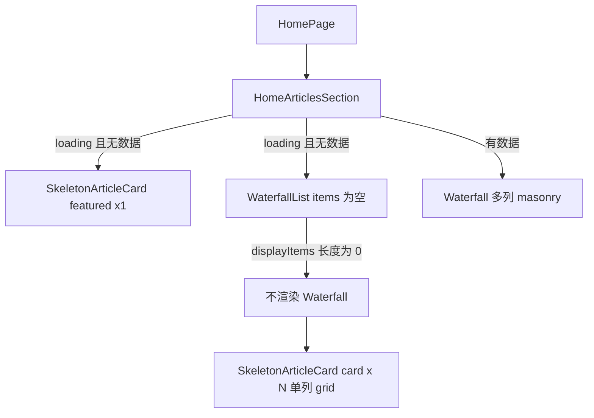

# 首页「发现」文章列表骨架布局：问题说明与改造方案

## 1. 现象

首页「发现」区块在首屏加载时，文章列表骨架呈现为**纵向单列**（多张骨架卡片上下堆叠），与数据就绪后 `@zxzinn/vue-waterfall` 的**多列瀑布流**不一致，观感上像「只有很窄的一列」。

## 2. 涉及文件

| 角色 | 路径 |
|------|------|
| 页面组合 | `src/modules/home/pages/HomePage.vue`（仅挂载「发现」区块，不实现骨架细节） |
| 文章区与加载分支 | `src/modules/home/components/HomeArticlesSection.vue` |
| 列表容器与空数据加载 UI | `src/shared/components/layout/WaterfallList.vue` |
| 骨架卡片 | `src/shared/components/feedback/skeletons/SkeletonArticleCard.vue` |

## 3. 根因分析

### 3.1 加载态不经过瀑布流组件

`WaterfallList` 仅在 `displayItems.length > 0` 时渲染 `Waterfall`，并传入 `column-width`、`gap`。首屏 `items` 为空且 `loading === true` 时：

- 不挂载 `Waterfall`，`columnWidth` / `gap` **不参与布局**；
- 仅渲染默认插槽中的 `SkeletonArticleCard`（多张 `card` 变体）。

因此骨架阶段与「有数据后的多列 masonry」走的是**两条完全不同的布局路径**。

### 3.2 骨架卡片容器默认为单列 Grid

`SkeletonArticleCard` 根节点 `.skeleton-article-stack` 使用 `display: grid` 且仅设置 `gap`，未设置 `grid-template-columns`。多张 `card` 骨架落在**隐式单列**上，自然纵向排列。

### 3.3 与首页数据分支的对比

`HomeArticlesSection` 在有数据时通过 `useElementSize(sectionRef)` 计算 `waterfallColumnWidth`、`waterfallGap`，并传给 `WaterfallList`。**加载分支**中的 `WaterfallList` 历史上未同步传入这两项（且即使传入，空列表时也不会用于 `Waterfall`），进一步加剧「骨架单列 vs 真实多列」的差异。

### 3.4 次要：加载容器样式叠加

`WaterfallList` 中空数据加载节点同时带有 `loading-state` 与 `loading-skeleton`。后者中的 `display: grid` 会覆盖前者中的 `display: flex`。通常不会单独导致「像素级窄条」，但会使「居中 flex 加载区」的语义失真，后续若加居中加载文案需留意。

### 3.5 原方案 B 还差一层：外层变多列，不代表骨架项会自动拆列

如果只把 `WaterfallList` 的加载外层改成与瀑布流一致的栅格，但默认内容仍然是：

- 一个 `SkeletonArticleCard`
- 且 `count = 6`

那么外层 grid 实际上只会看到**一个子节点**，这 6 张骨架卡仍旧会继续在 `SkeletonArticleCard` 内部按单列堆叠。也就是说：

- **仅让外层容器变成多列，不足以修复首页发现区骨架问题；**
- 还必须在 `WaterfallList` 的 `card` 骨架加载态中，渲染为**多个独立的骨架项**（每项 `count = 1`），让外层栅格真正参与分列。

## 4. 改造方案（按侵入性由低到高）

### 方案 A：仅增强 `SkeletonArticleCard` 的多列布局

对 `variant="card"` 且 `count > 1` 时，为 `.skeleton-article-stack` 增加响应式多列，例如：

`grid-template-columns: repeat(auto-fill, minmax(280px, 1fr))`（具体 `minmax` 可与设计对齐）。

- **优点**：改动面小，所有复用多张 card 骨架的场景一并改善。
- **缺点**：列宽为近似值，与真实 `Waterfall` 列数可能仍有细微差别。

### 方案 B：在 `WaterfallList` 加载态使用与瀑布流一致的栅格

在「无数据且 loading」分支的外层容器上，使用与瀑布流一致的列宽语义，例如：

`repeat(auto-fill, minmax(var(--skeleton-column-width), 1fr))`，

其中 `--skeleton-column-width` 由传入的 `columnWidth`（及 gap）映射而来。同时在 `HomeArticlesSection` 的加载分支为 `WaterfallList` **传入**与有数据时相同的 `:column-width`、`:gap`。

但这里还要多做一步：

- 当 `loadingSkeletonVariant="card"` 且未传自定义 `loading` 插槽时；
- `WaterfallList` 不能继续渲染一个 `SkeletonArticleCard(count = N)`；
- 应改为渲染 **N 个独立的 `SkeletonArticleCard(count = 1, variant = "card")`**，让骨架卡真正按外层栅格分布。

- **优点**：首页发现区骨架与真实列表的列宽、间距同源，一致性最好。
- **缺点**：需同时改 `WaterfallList` 的默认加载渲染方式，以及 `HomeArticlesSection` 的 props 传递。

### 方案 C：占位数据仍走 `Waterfall`

加载时注入占位 `items`，继续渲染 `Waterfall`，在 slot 内渲染骨架卡。

- **优点**：列数与瀑布流算法完全一致。
- **缺点**：实现与联调成本最高，需验证库对占位项的行为。

### 方案 D（顺带）：整理加载容器 class

拆分或合并 `loading-state` / `loading-skeleton`，避免 `display` 互相覆盖；若需居中加载文案，单独一层结构或明确 `place-items`。

- **不解决多列问题**，仅改善可维护性。

## 5. 建议

- 若优先**视觉与真实版面一致**：采用**优化后的方案 B**（可叠加方案 D）。
- 若优先**最小改动、快速消除单列观感**：采用 **方案 A**。
- **方案 C** 仅在强一致且可接受联调成本时采用。

## 6. 参考数据流（概念）

---

*文档状态：问题分析与方案记录；实现以代码库为准。*
